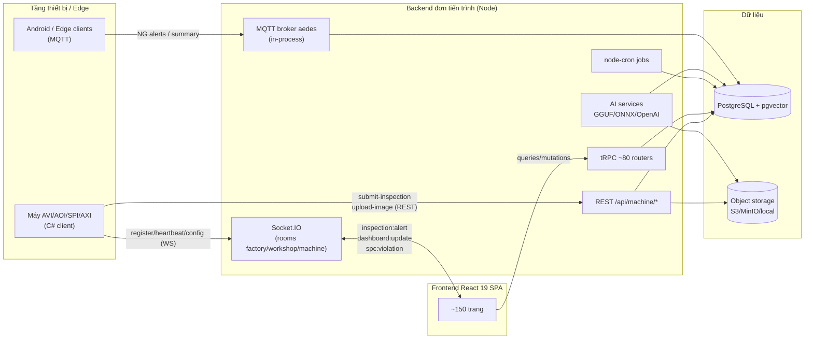
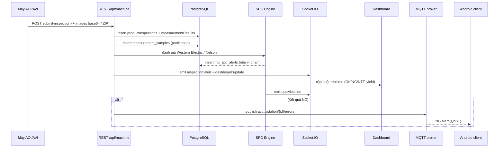
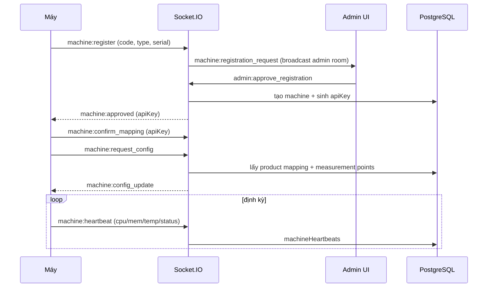
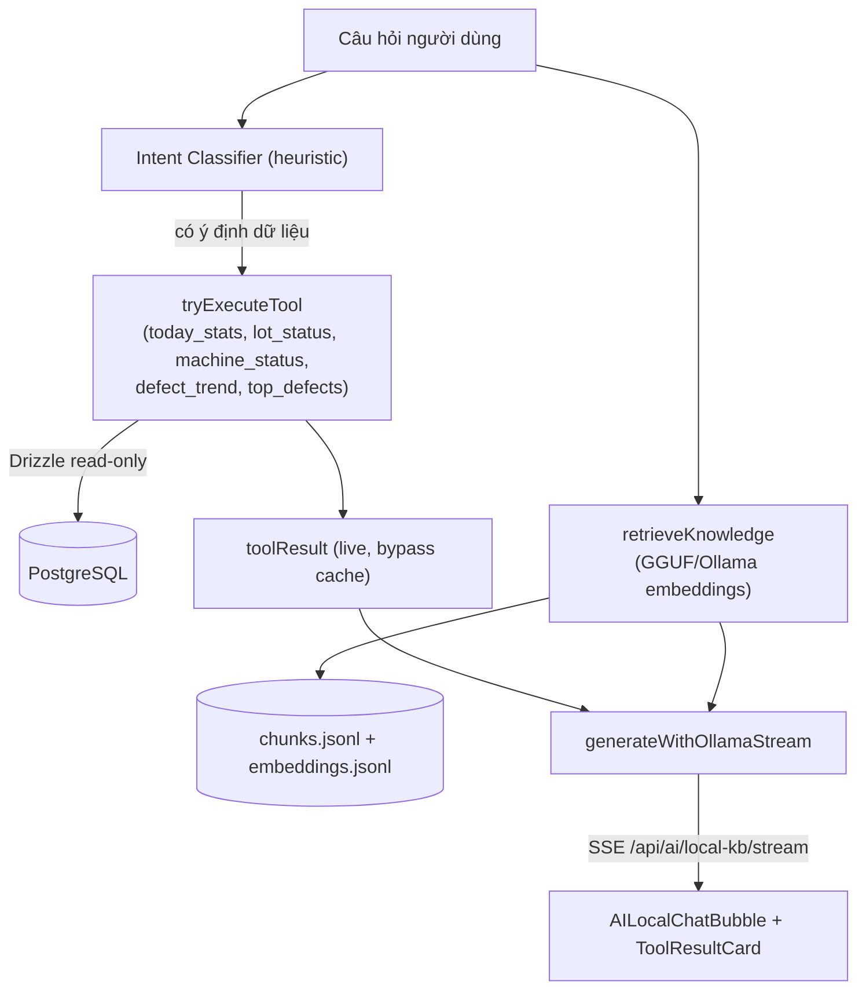
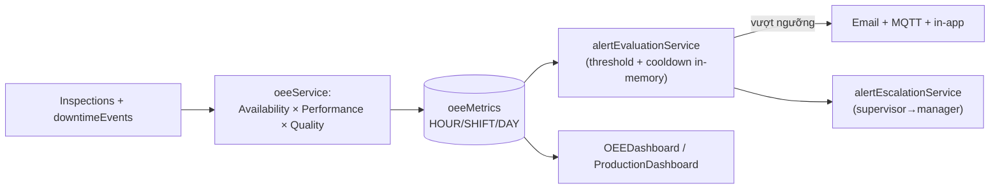
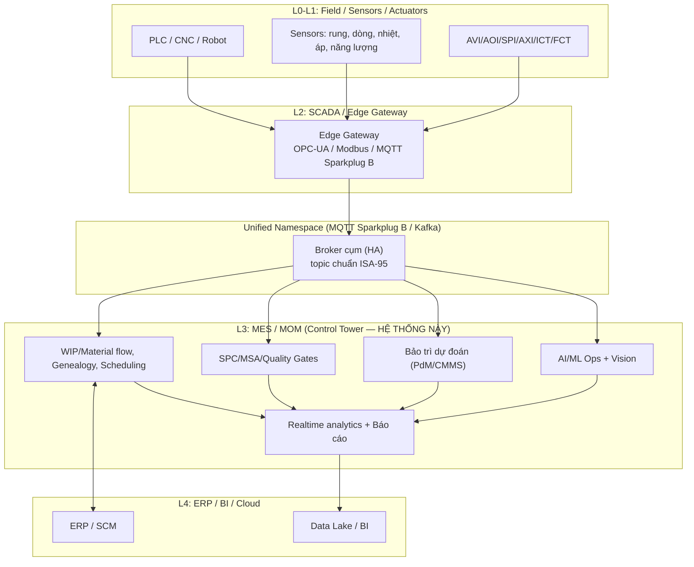
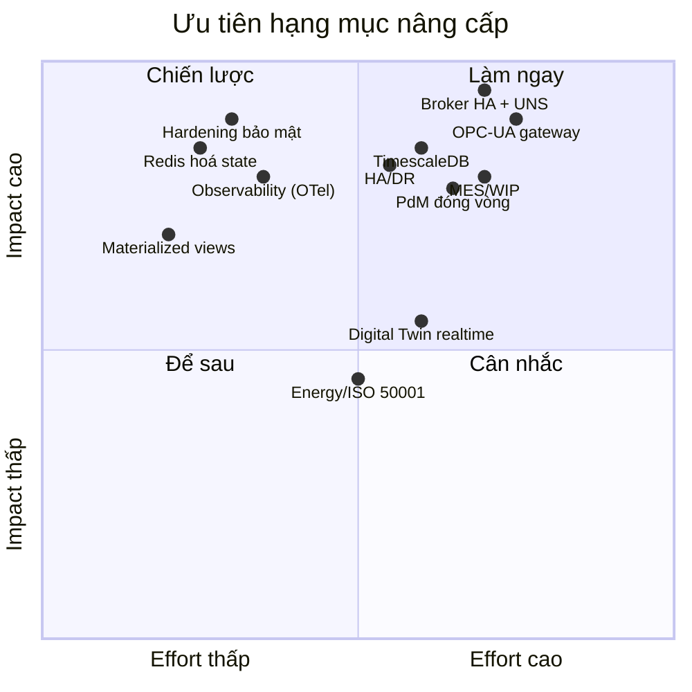

# AVI-AOI Management — Audit Toàn Hệ Thống, Sơ Đồ Luồng, GAP & Lộ Trình Nâng Cấp 4.0

> Sản phẩm bàn giao tổng hợp từ 3 AI Agent audit song song (Frontend / Backend / Database).
> Mục tiêu: đưa hệ thống trở thành **trung tâm điều hành (control tower)** cho một hệ sinh thái nhà máy sản xuất thông minh 4.0.
> Ngày: 2026-06-01

---

## 0. Tóm tắt điều hành (Executive Summary)

Hệ thống AVI-AOI hiện tại đã **rất trưởng thành** cho bài toán *quản lý kiểm tra quang học (AVI/AOI)* và phân tích chất lượng: stack hiện đại (React 19 + tRPC + Drizzle + PostgreSQL phân vùng + MQTT broker nội bộ + Socket.IO + AI cục bộ GGUF/ONNX). 110 migration, ~150 bảng, ~80 router tRPC, ~150 trang frontend, đầy đủ SPC, MSA/Gage R&R, OEE, IPC-A-610, ISA-95 signoff, pgvector image-search, edge AI deployment.

**Phân loại trưởng thành (đồng thuận với đánh giá vận hành nội bộ):** hệ thống hiện **không còn là prototype** mà đã ở mức **"advanced MES + industrial analytics platform"** — đã có hạt nhân dữ liệu, realtime, báo cáo, AI, và một số luồng công nghiệp chuyên sâu thực sự (triangulation trạm, gợi ý & phê duyệt ngưỡng, hình học đo lường, edge/dataset/calibration AI). **Điểm yếu lớn nhất không phải thiếu tính năng, mà là thiếu một *lớp điều phối thống nhất (orchestration layer)*** để biến các module mạnh-nhưng-rời thành một hệ sinh thái vận hành theo **chuỗi giá trị sản xuất** (lệnh SX → ca/lô → công đoạn → chất lượng → truy xuất → bảo trì).

**Tuy nhiên**, để trở thành *trung tâm của hệ sinh thái tự động hóa 4.0* (không chỉ AOI mà điều phối **toàn bộ dây chuyền, thiết bị, vật tư, năng lượng, bảo trì, truy xuất nguồn gốc realtime**), hệ thống còn các khoảng trống lớn về: **lõi điều hành sản xuất (production execution core) chuẩn ISA-95**, **scale realtime đa tiến trình**, **mô hình dữ liệu time-series/semantic cấp công nghiệp**, **lớp UNS/OPC-UA cho thiết bị PLC/SCADA**, **MES/WIP/material flow**, **truy xuất as-built đóng vòng**, **bảo trì dự đoán đóng vòng**, **governance/compliance cấp doanh nghiệp**, và **observability/DR cấp doanh nghiệp**.

| Trục đánh giá | Điểm hiện tại | Mục tiêu 4.0 |
|---|---|---|
| Kiến trúc ứng dụng | 8/10 | 9/10 |
| Realtime & messaging | 6/10 (single-process) | 9/10 (cluster + UNS) |
| Mô hình dữ liệu / Time-series | 6/10 | 9/10 |
| Kết nối thiết bị (OT/PLC/SCADA) | 3/10 (chỉ AOI/AVI qua API/MQTT) | 9/10 (OPC-UA/Modbus/UNS) |
| MES / WIP / Material flow | 3/10 | 8/10 |
| Bảo trì dự đoán (PdM) | 4/10 (chưa đóng vòng) | 8/10 |
| Analytics & Báo cáo realtime | 7/10 | 9/10 |
| Bảo mật / RBAC / Compliance | 7/10 | 9/10 |
| Khả năng mở rộng / HA-DR | 5/10 | 9/10 |
| Observability | 4/10 | 9/10 |

**Điểm trưởng thành tổng thể: ~5.8/10 → mục tiêu 8.8/10** (lộ trình 4 giai đoạn / ~9–12 tháng).

---

## 1. Hiện trạng hệ thống (Current State)

### 1.1 Stack công nghệ
- **Frontend:** React 19, Vite, tRPC client, TanStack Query, wouter, TailwindCSS + Radix UI, Recharts, three/react-three-fiber (3D factory), i18next (vi/en/zh), socket.io-client.
- **Backend:** Node + Express + tRPC v11 (~80 router), Drizzle ORM, aedes (MQTT broker nội bộ), Socket.IO, node-cron, AI cục bộ (node-llama-cpp GGUF, onnxruntime, openai), jose (JWT), speakeasy (2FA), license SDK.
- **Database:** PostgreSQL + pgvector, ~150 bảng, 110 migration, phân vùng theo tháng cho `measurement_samples`.
- **Storage:** Forge/S3/MinIO hoặc local FS cho ảnh & gói ZIP AOI.

### 1.2 Bản đồ domain chức năng (phân cụm)

| Domain | Frontend (trang tiêu biểu) | Backend (router tiêu biểu) | DB (bảng lõi) |
|---|---|---|---|
| Phân cấp tổ chức | CorporateLayout, Layout, WorkstationManagement | factory, workshop, line, station, machine | corporates, factories, workshops, productionLines, stations, machines |
| Máy & sức khỏe máy | MachineStatusMonitor, MachineHealthMonitoring, MachineOnboardingWizard | machineStatus, machineApi | machineStatusLogs, machineHeartbeats, machineHealthHistory |
| Sản phẩm & điểm đo | ProductModels, ProductMachineMapping | productModel, measurementPoint, fiducialMark, defectCatalog | productModels, measurementPointDefs, defectCatalog |
| Kiểm tra (AVI/AOI) | History, InspectionDetail, AOIPackages | inspection, measurementResult, aoiPackage | productInspections, measurementResults, inspectionPackages |
| SPC & Chất lượng | SPCAnalysis, SPCAdvanced, QualityGates, ParetoAnalysis | spcAnalysis, spcConfig, qualityGate, correlation, cpkTrend | spcConfigurations, spcRuleViolations, cpkHistory, qualityGates |
| OEE & Sản xuất | OEEDashboard, ProductionOrders, ProductionScheduling, ProductionDashboard | oee, productionOrder, lineStage, productionSession | oeeMetrics, downtimeEvents, oeeTargets, productionOrders, dailyStatistics |
| MSA / Calibration | (trong Products) | instrumentCalibration, instrumentMsaRecord, msaAdvanced | measurementInstruments, instrumentCalibrations, instrumentMsaRecords, msaStudies |
| Realtime / IoT (MQTT) | MqttDashboard, MqttClients, MqttTopicsMessages, MQTTReplay | mqttClient, mqttAlert | mqttClients, mqttSubscriptions, mqttMessageLogs, mqttConnectionLogs |
| AI/ML | AIHub, AIChat, AdvancedVisionLab, ModelMonitoring, AIImageSearch | 70+ router AI (aiModel, aiGguf, aiLocalKb, aiActiveLearning, edgeDeployment...) | aiModels, imageEmbeddings, aiActiveLearningSamples, aiEdgeDeployments |
| Báo cáo | Reports, ScheduledReports, PdfReports, PowerPointExport, ReportBuilder | pdfReport, powerpoint, reportBuilder, scheduledReport | scheduledReports, scheduledReportLogs |
| Cảnh báo | Alerts, PredictiveAlertsPage | alert, notification, yieldThreshold, mqttAlert | alertSettings, alertHistory, predictiveAlerts, alertEscalations |
| Quản trị & RBAC | AdminSettings, Users, RoleBuilder, AuditLogs, Sessions | user, userAssignment, twoFactor, audit, license | users, permissions, userRoles, userSessions, auditLogs, licenses |

### 1.3 Năng lực công nghiệp & AI chuyên sâu đã có (điểm mạnh nền tảng)

Ngoài các domain cơ bản, hệ thống đã có sẵn một số luồng công nghiệp **nâng cao** — đây là nền tảng tốt để mở rộng lên 4.0, không cần làm lại:

| Năng lực | Hiện trạng | File tiêu biểu |
|---|---|---|
| **Triangulation giữa các trạm** | Tương quan vị trí/kết quả đa trạm (SPI→AOI→AXI...) phục vụ root-cause | [stationTriangulationRouter.ts](server/routers/stationTriangulationRouter.ts) |
| **Governance ngưỡng (đã manh nha)** | Gợi ý ngưỡng + luồng phê duyệt thay đổi ngưỡng | [thresholdSuggestionRouter.ts](server/routers/thresholdSuggestionRouter.ts), [thresholdApprovalRouter.ts](server/routers/thresholdApprovalRouter.ts) |
| **Hình học đo lường** | Tính toán geometry (crop/normalize/transform) cho điểm đo | [measurementGeometry.ts](server/lib/measurementGeometry.ts) |
| **API phân lớp rõ** | REST external + AI streaming (SSE) + local KB tách bạch | [externalInspectionApi.ts](server/routes/externalInspectionApi.ts), [aiStreamingApi.ts](server/routes/aiStreamingApi.ts), [aiLocalKnowledgeApi.ts](server/routes/aiLocalKnowledgeApi.ts) |
| **AI/Edge nền tảng tốt** | Edge packaging/canary, dataset builder, calibration, A/B test, health check | [aiEdgeEnhanced.ts](server/services/aiEdgeEnhanced.ts), [aiDatasetBuilder.ts](server/services/aiDatasetBuilder.ts) |

> ⚠️ Lưu ý: các năng lực AI/edge và governance ngưỡng hiện là **capability rời** — chưa được nối thành một *governance loop* (calibration → monitoring → rollback → explanation → canary → approval). Đây là trọng tâm của Giai đoạn 3 (xem §5).

---

## 2. Sơ đồ luồng hoạt động hiện có (As-Is Flows)

### 2.1 Kiến trúc tổng thể hiện tại

### 2.2 Luồng kiểm tra (Inspection) — từ máy đến dashboard

### 2.3 Luồng đăng ký & đồng bộ máy (Onboarding)

### 2.4 Luồng AI cục bộ (Local KB + Tool Calling)

### 2.5 Luồng OEE & cảnh báo

---

## 3. Kiến trúc tham chiếu hệ thống 4.0 (To-Be Reference)

Một *trung tâm điều hành nhà máy thông minh 4.0* chuẩn cần các tầng theo mô hình **ISA-95 + UNS (Unified Namespace)**:

**Trụ cột bắt buộc của control tower 4.0:**
1. **Kết nối OT đa giao thức** (OPC-UA, Modbus/TCP, Sparkplug B) — không chỉ máy AOI.
2. **Unified Namespace (UNS)** — single source of truth realtime, topic chuẩn hoá theo ISA-95.
3. **MES/MOM lõi**: WIP tracking, material genealogy, line balancing, dispatching.
4. **Time-series store cấp công nghiệp** (TimescaleDB/ClickHouse) + downsampling + nén.
5. **PdM đóng vòng**: telemetry → mô hình → work order bảo trì → hiệu quả.
6. **Realtime analytics**: stream processing (CEP), KPI sub-giây, anomaly online.
7. **Digital Twin** layout + mô phỏng.
8. **Observability + HA/DR cấp doanh nghiệp**.

---

## 4. Phân tích GAP (As-Is vs To-Be 4.0)

### 4.1 Bảng GAP theo trục năng lực

| # | Năng lực 4.0 | Hiện trạng | GAP | Mức ưu tiên |
|---|---|---|---|---|
| G1 | Kết nối thiết bị OT (PLC/SCADA) | Chỉ AVI/AOI qua REST/WS + MQTT custom | Thiếu OPC-UA, Modbus, Sparkplug B; không gom được PLC/robot | 🔴 P0 |
| G2 | Unified Namespace | MQTT topic riêng `avi/...`, broker in-process | Không có UNS chuẩn ISA-95; broker không HA, mất khi restart | 🔴 P0 |
| G3 | Realtime scale | Socket.IO + aedes đơn tiến trình, state in-memory | Không cluster được; cooldown/connection map mất khi restart | 🔴 P0 |
| G4 | Time-series cấp CN | Partition theo tháng cho `measurement_samples` | Thiếu nén, hypertable, downsampling, BRIN, materialized view rollup | 🟠 P1 |
| G5 | MES / WIP / Material flow | Có productionOrders, sessions | Thiếu WIP tracking, line balance, station dwell, dispatching realtime | 🟠 P1 |
| G6 | Truy xuất nguồn gốc vật tư | Chỉ genealogy chain (0095) | Thiếu material_receipts, supplier lot, lot_disposition (rework/scrap) | 🟠 P1 |
| G7 | Bảo trì dự đoán đóng vòng | machineHealthHistory + downtimeEvents | Thiếu maintenance_schedules, work_orders, spare_parts, PM effectiveness | 🟠 P1 |
| G8 | Analytics realtime/stream | Polling 30s + Socket emit | Thiếu CEP/stream processing, KPI sub-giây, anomaly online; chưa dùng SSE | 🟠 P1 |
| G9 | Báo cáo realtime | Recharts + scheduled PDF/PPT | Thiếu materialized view cache, downsampling cho mobile, live drill-down | 🟡 P2 |
| G10 | Digital Twin / 3D | Factory3DScene tĩnh | Chưa gắn realtime state vào 3D; không có mô phỏng/what-if | 🟡 P2 |
| G11 | Observability | console.log/pino rải rác | Thiếu tracing (OTel), metrics (Prometheus/Grafana), error tracking (Sentry) | 🟠 P1 |
| G12 | HA / DR | Backup cron | Thiếu WAL archiving, read replica, cross-region, verify-restore | 🟠 P1 |
| G13 | Bảo mật / hardening | RBAC + 2FA + license | CORS `*`, apiKey qua query param/không hash rõ, OAuth state yếu, thiếu MIME validation upload | 🔴 P0 |
| G14 | Năng lượng / sustainability | Không có | Thiếu energy monitoring, carbon/EnPI (ISO 50001) | 🟡 P2 |
| G15 | Chất lượng dữ liệu/normalize | Code factory/workshop duplicate trong inspections, enum trùng | Cần chuẩn hoá FK, gộp enum alertType*, contract schema máy | 🟡 P2 |

### 4.2 GAP nội tại cần hoàn thiện (không cần thêm phạm vi)

**Frontend (hoàn thiện luồng hiện có):**
- Chuẩn hoá loading/error state (đang lẫn skeleton/spinner/silent).
- Loại `any` types (AdvancedVisionLab, AIImageSearch), i18n hoá message validation (đang hardcode tiếng Việt trong `useFormValidation.ts`).
- Dọn file `.original/.bak/.disabled`, thêm Error/Suspense boundary đồng bộ.
- Accessibility (chỉ 17 aria-*), responsive cho dashboard nặng & 3D (thiếu touch controls).
- Bỏ `console.log` production; thêm Web Vitals + cache invalidation theo socket event (đang refetch thủ công).

**Backend (hoàn thiện luồng hiện có):**
- Redis hoá state (assignment cache, alert cooldown, machine connection map).
- Email/alert retry + hàng đợi bền (hiện mất khi restart).
- Audit toàn bộ `db.execute(sql\`...\`)` ở external API; thêm validate ngày/giới hạn.
- Hash API key + cơ chế xoay vòng; siết CORS allow-list; CSRF token cho OAuth state.
- MIME/anti-malware cho upload; giới hạn kích thước theo endpoint (batch inference OOM).
- Model eviction cho GGUF cache; statement_timeout + PgBouncer.

**Database (hoàn thiện luồng hiện có):**
- Materialized view `hourly_yield_cache`, `shift_summary_cache`, `machine_status_latest`.
- Nén + retention policy theo partition (pg_partman); BRIN cho partition cũ; ANALYZE định kỳ.
- Append-only thực sự + hash-chain cho audit log (CFR 21 Part 11).
- Gộp enum trùng (`alertTypeEnum`*), bỏ denormalize code thừa trong `productInspections`.

### 4.3 GAP cấp điều phối (từ đánh giá vận hành nội bộ — đã lọc & xác thực)

Đây là nhóm GAP **mang tính chiến lược-điều phối**, bổ sung cho bảng năng lực kỹ thuật ở §4.1. Điểm chung: hệ thống **đủ tính năng** nhưng **thiếu xương sống điều phối** theo chuỗi giá trị.

| # | GAP điều phối | Diễn giải | Ánh xạ roadmap |
|---|---|---|---|
| C1 | **Production execution core chuẩn ISA-95** | Đã có master data + inspection + reporting + monitoring, nhưng chưa có *xương sống* đủ mạnh cho lệnh SX, production session, shift handover, **line-state machine**, và lifecycle từng ca/lô | GĐ 2 (MES/WIP) · bổ sung line-state machine + shift handover |
| C2 | **Traceability đóng vòng (as-built record)** | Đã có genealogy + triangulation, nhưng cần hợp nhất thành **as-built record**: máy + vật liệu + ca + recipe + calibration + MSA + môi trường + rework, để truy 1 serial đầu→cuối | GĐ 2 (G6) · mở rộng thành as-built unified record |
| C3 | **Công nghiệp hóa realtime (line control plane)** | MQTT đã có, nhưng cần chuẩn hóa **device onboarding, TLS, policy, station state, recipe sync** và kết nối kiểu *line control plane* chặt hơn | GĐ 0+1 (G2/G3) · bổ sung TLS/policy/recipe-sync |
| C4 | **Data backbone thống nhất** | Mới ở mức operational analytics (dashboard/SPC/Pareto/AI report); cần lớp **event/time-series/semantic model thống nhất** cho KPI, cảnh báo, truy vấn đa tầng | GĐ 1 (G4/G8) · bổ sung semantic/metric layer |
| C5 | **Governance & compliance enterprise-grade** | Đã có audit logs + 2FA + permissions; cần **immutable audit, retention, e-sign approval, approval workflow cho thay đổi ngưỡng, khóa vận hành cho vai trò nhạy cảm** | GĐ 0 (audit append-only) + GĐ 3 (e-sign/approval) |
| C6 | **AI/ML Ops governance loop** | Các capability calibration/monitoring/rollback/explanation/canary/approval cần nối thành **một vòng governance** thay vì rời rạc | GĐ 3 (AI/ML Ops nâng cao) |
| C7 | **UI/UX theo vai trò & tác vụ** | Nhiều page tốt cho từng nghiệp vụ nhưng phân mảnh; vai trò "trung tâm hệ sinh thái" cần **gom thành luồng theo role/task** để ít phải nhảy trang | GĐ 3 (UX consolidation theo persona) |

---

## 5. Lộ trình nâng cấp chi tiết (Roadmap)

> Nguyên tắc: **không phá vỡ luồng đang chạy** (migration-safe, feature-flag, mở rộng trước - cắt sau). Mỗi giai đoạn có *Definition of Done* và KPI đo lường.

### Giai đoạn 0 — Ổn định & Hardening nền tảng (2–3 tuần) · P0 · 🟡 ĐANG TRIỂN KHAI
**Mục tiêu:** Sẵn sàng scale & an toàn trước khi mở rộng.
- [~] Tích hợp **Redis** (ioredis đã có): Socket.IO adapter ✅ (flag `REDIS_URL`); cache abstraction ✅ — `redisService` (get/set/invalidate, fallback in-memory) + `distributedCache` (cooldown SET-NX atomic, assignment cache); MQTT bridge state ⏳.
- [~] **Hardening bảo mật (G13):** CORS allow-list theo ENV ✅; hash API key (nền tảng additive) ✅; upload MIME validation + giới hạn size theo route ✅; bỏ apiKey qua query param ⏳ (cần phối hợp client); CSRF token cho OAuth state ⏳.
- [~] **Observability (G11):** OpenTelemetry tracing ✅ + Sentry ✅ (flag); Prometheus `/metrics` ✅ (flag `METRICS_ENABLED`); Grafana dashboard ⏳; thay `console.*` bằng pino ⏳ (partial).
- [~] DB: `statement_timeout` ✅ (qua `DB_STATEMENT_TIMEOUT_MS`); materialized view `machine_status_latest` ✅; PgBouncer ⏳ (hạ tầng); ANALYZE cron ⏳.
- [x] FE: dọn file `.bak/.original` ✅, i18n hoá validation ✅; chuẩn hoá Error/Loading boundary ⏳ (partial).

**DoD:** chạy 2 instance backend sau load balancer, realtime vẫn nhất quán; pentest cơ bản pass; có dashboard tracing/metrics.

> 📌 **Tiến độ 2026-06-01:** Quick Wins §8 hoàn tất. Các hạng mục code-only của Giai đoạn 0 đã triển khai & **build xanh (exit 0)**: `statement_timeout` (`server/db/connection.ts`), Prometheus `/metrics` (`server/_core/metrics.ts`, flag `METRICS_ENABLED`), upload MIME/size validation theo route (`server/_core/uploadValidation.ts` → `upload-Guard("apk"|"zip")`), cache abstraction (`server/services/distributedCache.ts` trên `redisService`). Tất cả feature-flag, no-op/in-memory khi hạ tầng chưa bật. Các mục ⏳ phụ thuộc hạ tầng thực (Redis/PgBouncer/Grafana) hoặc cần phối hợp client máy, sẽ bật bằng ENV khi sẵn sàng.

### Giai đoạn 1 — Realtime công nghiệp & Time-series (4–6 tuần) · P0–P1
**Mục tiêu:** Lõi realtime cấp 4.0.
- [~] **UNS + Broker HA (G1,G2):** Bridge chuẩn hoá topic ISA-95 + **Sparkplug B** đã code (`server/services/unsBridge.ts`, flag `UNS_BRIDGE_ENABLED`/`UNS_SPARKPLUG_ENABLED`), giữ tương thích ngược `avi/...`; broker ngoài (EMQX/HiveMQ/Mosquitto cluster) thay aedes ⏳ (hạ tầng).
- [~] **Edge Gateway OPC-UA/Modbus (G1):** scaffold ingest `server/services/opcuaGateway.ts` (flag `OPCUA_GATEWAY_ENABLED` + `OPCUA_ENDPOINT_URL`, dynamic import node-opcua, no-op khi thiếu lib), wiring start/stop trong `startServer`/shutdown; cài package + map vào `machines` enum AUTOMATION ⏳.
- [ ] **Time-series store (G4):** đánh giá **TimescaleDB** (hypertable cho `measurement_samples`, `machineHeartbeats`, `machineSensorReadings`) + nén + retention; materialized view rollup (`hourly_yield_cache`, `shift_summary_cache`).
- [~] **Stream/CEP (G8):** lớp SSE realtime `server/_core/sse.ts` (endpoint `GET /api/stream`, flag `SSE_ENABLED`, broadcast theo channel) thay polling 30s; CEP/anomaly online (NodeRED/own consumer) ⏳.

**DoD:** ingest ≥10k msg/s ổn định; broker restart không mất realtime; dashboard yield/OEE cập nhật <2s; query 2 năm <1s qua rollup.

> 📌 **Tiến độ 2026-06-01 (G1 code-only):** Đã triển khai 3 scaffold feature-flag & **build xanh (exit 0)**: UNS bridge ISA-95/Sparkplug B (`unsBridge.ts`), edge gateway OPC-UA (`opcuaGateway.ts`, wiring start trong `startServer` + stop trong `gracefulShutdown`), SSE realtime (`sse.ts`, route `/api/stream`). Tất cả no-op/in-memory khi flag tắt hoặc thiếu package; các mục ⏳ (broker HA, TimescaleDB, cài node-opcua, CEP) phụ thuộc hạ tầng, sẽ bật bằng ENV/cài package khi sẵn sàng.

### Giai đoạn 2 — MES / WIP / Bảo trì / Truy xuất (6–8 tuần) · P1
**Mục tiêu:** Biến hệ thống từ "QMS+AOI" thành **MES/MOM control tower**.
- [~] **WIP & Material flow (G5):** bảng `wip_tracking`, `station_dwell_time`, `line_balance_metrics`; dashboard line balance (starved/blocked đã có enum). _(schema + enum xong; dashboard UI ⏳)_
- [~] **Material traceability (G6):** `material_receipts`, `supplier_lots`, `lot_disposition` (rework/scrap/return) + nối genealogy 2 chiều (upstream supplier → downstream customer return). _(schema xong; genealogy có cột nối — UI/truy vấn ⏳)_
- [~] **PdM đóng vòng (G7):** `maintenance_schedules`, `maintenance_work_orders`, `spare_parts_inventory`, `pm_effectiveness_metrics`; trigger từ `machineHealthHistory.predictedFailureRisk` → tạo work order → đo MTTR/MTBF. _(schema + service tự sinh work-order + tính MTTR/MTBF xong)_
- [x] **Dispatching realtime:** mở rộng scheduler (đã có FIFO/Priority/EDF) sang điều phối thời gian thực dựa WIP/bottleneck. _(service `dispatchingService.ts` pure-compute + flag `DISPATCHING_REALTIME_ENABLED`, procedure `wip.dispatch`, 6/6 test xanh)_

**DoD:** truy xuất 1 serial ra toàn bộ lineage (vật tư→công đoạn→khách hàng); PM work order tự sinh từ dự đoán; dashboard WIP realtime.

> 📌 **Tiến độ 2026-06-01 (G2 code-only):** Đã thêm domain schema MES `drizzle/schema/mes.ts` (10 bảng: WIP `wip_tracking`/`station_dwell_time`/`line_balance_metrics`; truy xuất `material_receipts`/`supplier_lots`/`lot_disposition` có cột genealogy 2 chiều `supplierLotId`+`serialNumber`+`customerReturnRef`; PdM `maintenance_schedules`/`maintenance_work_orders`/`spare_parts_inventory`/`pm_effectiveness_metrics`) + 7 enum mới, đăng ký vào barrel. Service `pdmWorkOrderService.ts` (flag `PDM_WORKORDER_ENABLED`) tự sinh work-order PREDICTIVE từ `machineHealthHistory.predictedFailureRisk ≥ ngưỡng`, kèm hàm `computeMttrMtbf`; wiring start trong `startServer` + stop trong `gracefulShutdown` (no-op khi flag tắt). Migration `drizzle/0112_g2_mes_wip_traceability_pdm.sql` (idempotent, **chưa chạy**). **Build xanh (exit 0).** Còn lại ⏳: dashboard line-balance/WIP realtime, truy vấn lineage UI, dispatching realtime.

> 📌 **Tiến độ Sprint S1 — BE (code-only):** Đã đóng phần backend của các mục: **B1** router `wip` (list/summary/dwellByStation/lineBalance), **B2** router `traceability` (bySerial/byLot genealogy 2 chiều), **B3** `dispatchingService.ts` (pure-compute điều phối WIP/bottleneck, flag `DISPATCHING_REALTIME_ENABLED`) + procedure `wip.dispatch`, **B4** logger pino flag `LOG_JSON` + console-bridge opt-in (`LOG_BRIDGE_CONSOLE`), **B5** chặn master-key qua query param ở production + xác nhận OAuth CSRF state đã có sẵn (`consumeStateEntry`). Đăng ký router `wip`+`traceability` vào `server/routers.ts`. **Build xanh (exit 0)**, test dispatching 6/6.
>
> 📌 **Tiến độ Sprint S1 — FE (code-only):** **F1** trang `client/src/pages/WipLineBalance.tsx` (route `/wip-dashboard` + nav `nav.wipDashboard` + i18n vi/en/zh) tiêu thụ router `wip`: KPI (tổng WIP/blocked/starved/nút thắt), biểu đồ tròn WIP theo trạng thái, biểu đồ cột dwell/starved/blocked theo trạm (24h), bảng điều phối realtime từ `wip.dispatch` (B3) với nhãn lý do đa ngôn ngữ, bảng cân bằng chuyền khi lọc theo lineId. **F2** trang `client/src/pages/TraceabilityLineage.tsx` (route `/traceability` + nav `nav.traceability` + i18n vi/en/zh) tiêu thụ router `traceability`: tra cứu theo serial/lot, hiển thị genealogy 2 chiều (upstream supplier lots/material receipts ↔ downstream lot disposition), bảng WIP liên quan. **F3** trang `client/src/pages/DigitalTwinView.tsx` (route `/digital-twin` + nav `nav.digitalTwin` + i18n vi/en/zh) tiêu thụ router `digitalTwin`: màu máy theo status+health, heatmap defect, mô phỏng what-if năng suất. **F4** trang `client/src/pages/RealtimeReportView.tsx` (route `/realtime-report` + nav `nav.realtimeReport` + i18n vi/en/zh) tiêu thụ router `realtimeReport`: drill-down `healthSeries` (LineChart, downsampling LTTB), bảng EnPI/carbon từ `enpiSummary` + export CSV (BOM UTF-8), danh sách cột compliance theo view CFR21/IATF/ISO. **F5** trang `client/src/pages/CarbonDashboard.tsx` (route `/carbon-dashboard` + nav `nav.carbonDashboard` + i18n vi/en/zh) tiêu thụ `realtimeReport.enpiSummary`: KPI kWh/CO₂/EnPI/SP đạt, xu hướng năng lượng+phát thải (AreaChart), EnPI thực tế vs baseline theo máy (BarChart top 12). **Build xanh (exit 0)**. Còn lại QA/CI (Q1–Q2).

> 📌 **Tiến độ Sprint S1 — QA/CI (code-only):** **Q1** scaffold Playwright (`playwright.config.ts` testDir `e2e/`, chromium, baseURL `PLAYWRIGHT_BASE_URL`||`localhost:3000`) + smoke specs `e2e/api-health.spec.ts` (GET `/health`, `/api/oauth/providers`), `e2e/login.spec.ts`, `e2e/dashboard.spec.ts`; scripts `test:e2e`/`test:e2e:install` + devDep `@playwright/test`. **Q2** mở rộng `.github/workflows/ci.yml` thêm job `e2e` (needs build-test): install → `playwright install chromium` → build → start `node dist/index.js` → wait-on `/health` → `test:e2e` → upload `playwright-report`. Static check CI dùng `pnpm run check` (không có script `lint`). _Chạy e2e thực tế cần server live + `playwright install` → deferred theo nguyên tắc "chỉ code, chưa bật hạ tầng"._ **Sprint S1 (B1–B5, F1–F5, Q1–Q2) code-only hoàn tất.**

### Giai đoạn 3 — Analytics nâng cao, Digital Twin, HA/DR (6–8 tuần) · P1–P2
**Mục tiêu:** Trải nghiệm "trung tâm hiện đại nhất".
- [x] **Digital Twin (G10):** gắn realtime state vào `Factory3DScene` (màu máy theo operationStatus, heatmap defect 3D); mô phỏng what-if năng suất. _(service màu/what-if + router `digitalTwin` xong; **F3** trang `DigitalTwinView.tsx` tiêu thụ router — màu máy theo status+health, heatmap defect, what-if; build xanh)_
- [x] **Báo cáo realtime (G9):** drill-down live, downsampling cho mobile, export theo chuẩn (CFR21/IATF/ISO views). _(LTTB downsampling + định nghĩa cột compliance + router `realtimeReport` xong; **F4** trang `RealtimeReportView.tsx` — drill-down healthSeries + bảng EnPI/carbon + export CSV theo view; build xanh)_
- [~] **Năng lượng/Sustainability (G14):** energy monitoring + EnPI (ISO 50001), carbon dashboard. _(schema `energy_readings`/`enpi_metrics` + endpoint `enpiSummary` xong; **F5** trang `CarbonDashboard.tsx` — KPI kWh/CO₂/EnPI, xu hướng năng lượng+phát thải, EnPI thực tế vs baseline theo máy; build xanh. Còn lại ingest đo điện ⏳ hạ tầng)_
- [~] **HA/DR (G12):** WAL archiving → S3, read replica cho analytics, cross-region logical replication, verify-restore tự động. _(service verify-restore flag-gated `DR_VERIFY_ENABLED` + bảng `dr_restore_checks` xong; WAL/replica/cross-region ⏳ hạ tầng)_
- [~] **AI/ML Ops nâng cao:** feature store (`ml_feature_cache`), model serving/version live, inference audit đầy đủ, đóng vòng active-learning → retrain. _(schema `ml_feature_cache`/`ml_inference_audit` xong; serving/active-learning ⏳)_

**DoD:** RPO<5 phút/RTO<30 phút; twin phản ánh realtime; báo cáo compliance xuất 1 click.

> 📌 **Tiến độ 2026-06-01 (G3 code-only):** Thêm schema `drizzle/schema/g3.ts` (5 bảng: `energy_readings`, `enpi_metrics`, `ml_feature_cache`, `ml_inference_audit`, `dr_restore_checks`) + 3 enum (`energysourceenum`/`complianceviewenum`/`drcheckstatusenum`), đăng ký barrel. Service: `digitalTwinService.ts` (màu twin theo status+health, mô phỏng what-if bottleneck/line-balance — pure compute), `realtimeReportService.ts` (LTTB downsampling + cột compliance CFR21/IATF/ISO), `disasterRecoveryService.ts` (flag `DR_VERIFY_ENABLED`, ghi `dr_restore_checks`, wiring start/stop trong server). Router: `digitalTwin` (twinState/defectHeatmap/whatIf), `realtimeReport` (healthSeries downsampled/enpiSummary/complianceColumns) đăng ký vào `routers.ts`. Migration `drizzle/0113_g3_energy_ml_dr.sql` + runner `run-0113-migration.mjs` (idempotent, **chưa chạy**). **Build xanh (exit 0).** Còn lại ⏳ hạ tầng: ingest điện năng, tích hợp Factory3DScene, WAL/replica/cross-region DR, model serving.

### Giai đoạn 4 — Chuẩn hoá, chứng nhận, tối ưu (liên tục) · P2
- [~] Chuẩn hoá schema (gộp enum, bỏ denormalize, contract schema máy bằng zod/JSON-Schema versioned).
- [~] Bộ test E2E (Playwright) + CI/CD coverage; OpenAPI cho REST external.
- [ ] Tài liệu kiến trúc (ADR), sơ đồ schema, runbook vận hành.
- [ ] Đánh giá tuân thủ: IEC 62443 (an ninh OT), ISA-95, IATF 16949, ISO 17025, CFR 21 Part 11.

> 📌 **Tiến độ 2026-06-01 (G4 code-only):** Hợp đồng dữ liệu máy versioned `server/contracts/machineDataContract.ts` (zod v4, schema v1.0 phản ánh `submitInspection`; `validateMachinePayload` + xuất JSON-Schema draft-7 qua `z.toJSONSchema` cho đối tác ngoài). Router read-only `machineContract` (`versions`/`jsonSchema`/`validate`) đăng ký vào `routers.ts`. Test coverage `machineDataContract.test.ts` (7/7 pass, vitest). **Build xanh (exit 0).**
>
> Bổ sung: OpenAPI 3.0.3 cho REST external `server/openapi/externalApiSpec.ts` (`buildExternalOpenApiSpec(serverUrl)` — tài liệu hoá `/api/external/*`: auth/login, machines, hierarchy, statistics, alerts, bulletins, dashboard, reports, stations, server-time; 2 security scheme `masterKey` header `x-master-key` + `bearerAuth` JWT). Phục vụ public qua route `GET /api/external/openapi.json` trong `server/_core/index.ts` (tự suy `serverUrl` từ proto/host). Test `externalApiSpec.test.ts` (5/5 pass). Còn lại ⏳ hạ tầng/tài liệu: Playwright E2E + CI/CD pipeline, tài liệu ADR/sơ đồ schema/runbook (ràng buộc không tạo md mới), đánh giá tuân thủ IEC 62443/ISA-95/IATF/ISO/CFR21.

---

## 5.1 Backlog tổng hợp các hạng mục còn treo (toàn G0–G4)

> Gộp toàn bộ mục `[~]`/`[ ]` còn lại, phân loại theo **khả thi code-only** (làm được ngay, no-infra) vs **phụ thuộc hạ tầng/ngoài phạm vi code**. ID dùng để lập sprint ở §5.2.

### A. Code-only — đưa vào Sprint hoàn thiện
| ID | Hạng mục | GAP gốc | Mô tả ngắn | Phụ thuộc | Effort |
|----|----------|---------|------------|-----------|--------|
| **B1** | Router WIP / Line-balance | G5 | tRPC `wip` cấp dữ liệu `wip_tracking`/`station_dwell_time`/`line_balance_metrics` (starved/blocked) | schema mes.ts ✅ | M |
| **B2** | Router truy xuất lineage | G6 | tRPC `traceability` truy vấn genealogy 2 chiều từ 1 serial (vật tư→công đoạn→khách hàng) | schema mes.ts ✅ | M |
| **B3** | Dispatching realtime | G2 | mở rộng scheduler FIFO/Priority/EDF → điều phối theo WIP/bottleneck (pure compute + flag) | B1 | M |
| **B4** | Logger pino thay `console.*` | G11 | hoàn tất thay thế, giữ tương thích (wrapper), flag `LOG_JSON` | — | S |
| **B5** | Hardening còn lại | G13 | CSRF token cho OAuth state + bỏ `apiKey` qua query param (deprecate, vẫn nhận header/body) | — | S |
| **F1** | Dashboard WIP/Line-balance | G5 | trang FE realtime starved/blocked, dwell-time, line balance | B1 | L |
| **F2** | UI truy xuất lineage | G6 | màn tra cứu serial → cây genealogy 2 chiều | B2 | M |
| **F3** | Tích hợp Digital Twin 3D | G10 | nối router `digitalTwin` vào `Factory3DScene` (màu máy theo status+health, heatmap defect, what-if) | router `digitalTwin` ✅ | L |
| **F4** | Báo cáo realtime drill-down + export | G9 | dùng router `realtimeReport` (healthSeries/enpiSummary/complianceColumns) → UI drill-down + export CSV theo view CFR21/IATF/ISO | ✅ **Done** (`RealtimeReportView.tsx`, build xanh) | M |
| **F5** | Carbon / EnPI dashboard | G14 | UI EnPI (ISO 50001) + carbon từ endpoint `enpiSummary` | ✅ **Done** (`CarbonDashboard.tsx`, build xanh) | M |
| **Q1** | Playwright E2E scaffold | G4 | cài Playwright + config + smoke spec (login, dashboard, 1 luồng external API) | ✅ **Done** (`playwright.config.ts` + `e2e/` smoke: api-health/login/dashboard + scripts `test:e2e`; chạy e2e cần server live → deferred hạ tầng) | M |
| **Q2** | CI/CD pipeline | G4 | workflow YAML: install→check→build→vitest→(playwright) | ✅ **Done** (`.github/workflows/ci.yml`: job `e2e` build→start server→wait `/health`→playwright; static check dùng `pnpm run check`, không có script `lint`) | S |

### B. Phụ thuộc hạ tầng / ngoài phạm vi code (KHÔNG vào sprint này)
- **Hạ tầng bật bằng ENV/cài đặt:** Redis thật + MQTT bridge state (G0), broker HA EMQX/HiveMQ (G1), cài `node-opcua` (G1), TimescaleDB hypertable (G1), PgBouncer + ANALYZE cron (G0), Grafana dashboard (G11), WAL/replica/cross-region DR (G12), ingest đo điện thực (G14), model serving/active-learning runtime (G3).
- **Tài liệu (vướng ràng buộc "không tạo md mới"):** ADR, sơ đồ schema, runbook.
- **Chứng nhận:** đánh giá tuân thủ IEC 62443 / ISA-95 / IATF 16949 / ISO 17025 / CFR 21 Part 11.
- **Cần phối hợp client máy:** gỡ hẳn `apiKey` query (B5 chỉ deprecate phía server).

---

## 5.2 Sprint "Hoàn thiện 4.0 — Code-only" (S1)

**Thời lượng:** 2 tuần (10 ngày làm việc) · **Mục tiêu sprint (Sprint Goal):** Khép kín toàn bộ phần **logic + UI** còn treo của G0–G4 mà không cần hạ tầng, để mọi schema/service/router đã có đều có điểm tiêu thụ (router→UI) và pipeline kiểm thử tự động.

**Nguyên tắc:** code-only · feature-flag · additive (không phá luồng đang chạy) · build + test xanh từng mục · migration runners **không** tự chạy.

**Capacity giả định:** 1 dev full-stack, ~10 ngày. Tổng ước lượng: 4×S + 5×M + 3×L.

### Sprint Backlog (theo thứ tự thực thi)
| # | Task | ID | Loại | Ước lượng | DoD từng task |
|---|------|----|------|-----------|----------------|
| 1 | Router WIP/line-balance | B1 | BE | M | tRPC `wip` (list/summary) + zod input; build xanh; vitest cơ bản |
| 2 | Router lineage | B2 | BE | M | tRPC `traceability.bySerial` trả cây 2 chiều; build xanh; test |
| 3 | Logger pino | B4 | BE | S | wrapper `logger.ts`, thay `console.*` ở hot path, flag `LOG_JSON`; build xanh |
| 4 | Hardening B5 | B5 | BE | S | CSRF state OAuth + deprecate apiKey query (header/body vẫn chạy); build xanh |
| 5 | Dashboard WIP/line-balance | F1 | FE | L | trang + route + nav + i18n (vi/en/zh); dữ liệu từ B1; build xanh |
| 6 | UI lineage | F2 | FE | M | màn tra cứu serial → cây genealogy; i18n; build xanh |
| 7 | Digital Twin 3D | F3 | FE | L | màu máy + heatmap + what-if vào `Factory3DScene` qua router `digitalTwin`; build xanh |
| 8 | Báo cáo realtime + export | F4 | FE | M | drill-down + export CSV view compliance; build xanh |
| 9 | Carbon/EnPI dashboard | F5 | FE | M | UI EnPI + carbon từ `enpiSummary`; i18n; build xanh |
| 10 | Dispatching realtime | B3 | BE | M | service flag-gated theo WIP/bottleneck; build xanh; test |
| 11 | Playwright scaffold | Q1 | QA | M | cài + config + smoke specs (login/dashboard/external API) |
| 12 | CI/CD pipeline | Q2 | CI | S | workflow YAML install→lint→build→test→(e2e) |

### Lịch chi tiết theo ngày
| Ngày | Tập trung | Tasks | Output kỳ vọng |
|------|-----------|-------|----------------|
| D1 | Nền BE truy vấn | B1 | router `wip` + test, build xanh |
| D2 | Nền BE truy vấn | B2 | router `traceability` + test, build xanh |
| D3 | BE hygiene | B4, B5 | pino wrapper + hardening, build xanh |
| D4–5 | FE lớn #1 | F1 | dashboard WIP/line-balance hoàn chỉnh + i18n |
| D6 | FE #2 | F2 | UI lineage + i18n |
| D7–8 | FE lớn #2 | F3 | Digital Twin 3D tích hợp |
| D9 | FE #3 + #4 | F4, F5 | báo cáo realtime export + carbon/EnPI |
| D9 (song song) | BE | B3 | dispatching service |
| D10 | QA/CI | Q1, Q2 | Playwright smoke + pipeline YAML |

### Definition of Done (Sprint)
- Mọi schema/service/router của G2–G3 đã có **điểm tiêu thụ** (router cho schema, UI cho router).
- Toàn bộ tính năng mới **feature-flag/additive**, không phá luồng cũ; `pnpm build` exit 0.
- Bộ test: vitest cho router mới + Playwright smoke 3 luồng; CI chạy install→lint→build→test.
- i18n đủ 3 ngôn ngữ (vi/en/zh) cho mọi trang mới; không key thiếu.
- Roadmap cập nhật trạng thái `[~]→[x]` cho các mục code-only đã đóng.

### Ngoài sprint (chốt riêng khi có hạ tầng)
Toàn bộ mục **§5.1.B** (Redis/broker HA/TimescaleDB/PgBouncer/Grafana/DR/ingest điện/model serving) + tài liệu ADR/runbook + chứng nhận tuân thủ → lập **Sprint hạ tầng S2** khi môi trường thật sẵn sàng (cần DevOps/IT bật ENV, cài broker, cấp S3/replica).

---

## 6. Ma trận ưu tiên (Impact vs Effort)

---

## 7. KPI theo dõi chuyển đổi 4.0

| KPI | Hiện tại (ước) | Mục tiêu |
|---|---|---|
| Độ trễ realtime dashboard | ~30s (polling) | <2s (stream/SSE) |
| Throughput ingest | ~đơn tiến trình | ≥10k msg/s, cluster |
| Query lịch sử 2 năm | giây→phút | <1s (rollup) |
| RPO / RTO | ~24h / thủ công | <5 phút / <30 phút |
| Giao thức thiết bị hỗ trợ | 1 (AOI custom) | ≥4 (OPC-UA, Modbus, Sparkplug B, REST) |
| Truy xuất nguồn gốc | một phần | full lineage 1 serial |
| MTTR (bảo trì) | không đo | giảm ≥20% nhờ PdM |
| Coverage test | thấp | ≥70% lõi |

---

## 8. Khuyến nghị triển khai ngay (Quick Wins — tuần 1) — ✅ HOÀN TẤT (2026-06-01)
1. ✅ **Redis adapter cho Socket.IO + aedes state** → mở khoá scale (G3). — `server/_core/socketRedisAdapter.ts`, feature-flag `REDIS_URL`.
2. ✅ **CORS allow-list + hash API key + bỏ apiKey query param** (G13). — CORS allow-list theo `ALLOWED_ORIGINS`; `server/_core/apiKeyHash.ts` (additive); bỏ query-param: hoãn (cần phối hợp client máy).
3. ✅ **Materialized view `machine_status_latest` + `hourly_yield_cache`** → giảm tải DB ngay (G4/G9). — `drizzle/0111_qw3_materialized_views.sql` + `run-0111-migration.mjs` (chưa chạy) + service refresh có flag.
4. ✅ **OpenTelemetry + Sentry** → có "mắt" trước khi mở rộng (G11). — `server/_core/observability.ts`, feature-flag `SENTRY_DSN` / `OTEL_EXPORTER_OTLP_ENDPOINT`.
5. ✅ **Dọn file `.bak/.original`, i18n validation, chuẩn hoá loading/error** → chất lượng FE. — Đã xóa backup; i18n hoá `useFormValidation`.

> Tất cả thay đổi đều **feature-flag + build xanh (exit 0)**, không phá vỡ hệ thống đang chạy. Mục cần hạ tầng thực được bật bằng ENV khi sẵn sàng.

---

*Phụ lục: chi tiết file/line cho từng phát hiện nằm trong 3 báo cáo audit (Frontend / Backend / Database) đã thực hiện. Tài liệu này là bản tổng hợp điều hành để ra quyết định và lập kế hoạch sprint.*
