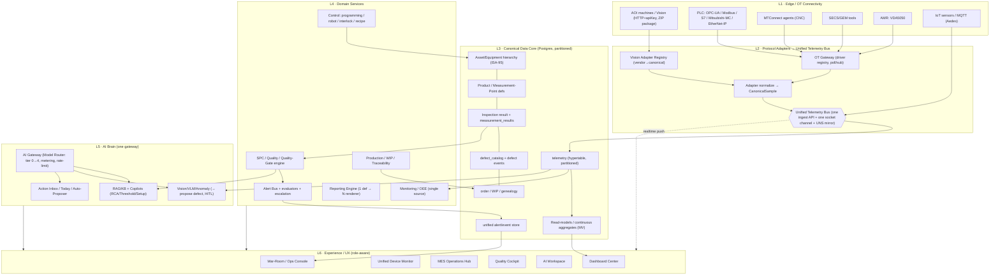
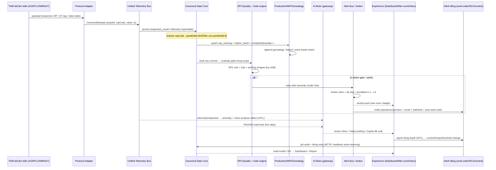
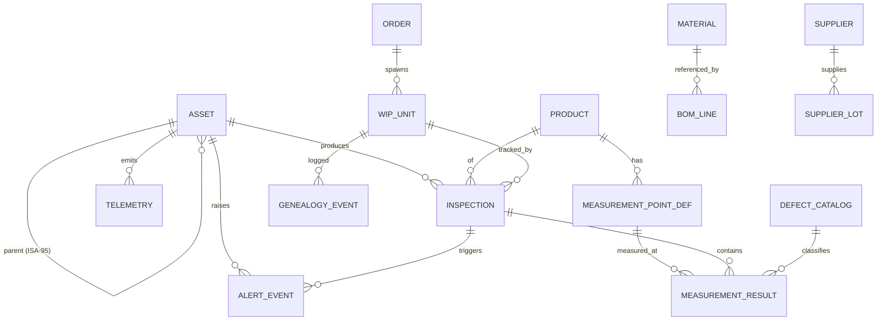

# 12 — Thiết kế lại Hệ sinh thái Hợp nhất (Unified Ecosystem Redesign)

> Tài liệu kiến trúc tổng (master redesign) — sẵn-sàng-ra-quyết-định.
> Hệ: AVI/AOI Management — React + tRPC + Drizzle/Postgres, Local-LLM brain (RTX 5090).
> Ngày: 2026-06-29 · Nhánh: `ai-assistant-knowledge-remediation`
> Đầu vào: 8 báo cáo audit miền (A–H) + docs ECOSYSTEM 01–11 + `shared/module-registry.ts`.
> Tác giả: Principal Systems Architect (ecosystem specialist).

---

## 1. Executive Summary — luận điểm cốt lõi

**Luận điểm:** Hệ thống này **không thiếu năng lực — nó thiếu sự gắn kết (cohesion).** Mọi miền đều có **backend mạnh** (SPC chính xác cấp công nghiệp, license/RBAC/2FA trưởng thành, MQTT broker production-grade, RAG/HITL local-AI chín, safety-gate đa lớp cho mọi lệnh ghi thiết bị, genealogy hash-chain, APS/CP-SAT scheduling). Nhưng hệ thống bị **phân mảnh nghiêm trọng**: ~144 trang / 149 router với trùng lặp diện rộng (~11 dashboard, 5 trang annotation, 4 trang quality, 4 trang AI-observability, 22+ trang AI, 5 hệ alert, 3 trang audit, 3 admin hub), nhiều **luồng chết** (template "Apply" no-op, alert evaluator không bao giờ chạy, Andon không báo cho ai, quality gate không tự kích hoạt), **số liệu bịa hiển thị như thật** (OEE=yield×0.85, employees=machines×4), **không có đường ingestion telemetry hợp nhất** (4–5 silo song song; OPC-UA/Modbus/S7/MTConnect/SECS/VDA5050/Sparkplug có driver thật nhưng không chạy), **WIP/traceability không có write path**, **master data siloed bằng free-text code thay vì FK**, **hai luồng ingest inspection phân kỳ** (bug `pointDefId:0` giấu toàn bộ dữ liệu AOI-ZIP khỏi SPC), **hai backend chat**, và **RBAC frontend không nhất quán**.

**Do đó định hướng KHÔNG phải "xây thêm" — mà là CONSOLIDATE & INTEGRATE.**

| | Nội dung |
|---|---|
| **GIỮ (keep)** | Toàn bộ engine backend mạnh: SPC engine (`utils/spc.ts`), RBAC/license/API-key/2FA core, MQTT/Aedes broker, RAG/KB + HITL + Model Router, safety-gate (programming/robot/interlock), genealogy hash-chain, APS scheduling, vision adapter registry, energy analytics (hình mẫu RBAC). |
| **HỢP NHẤT (consolidate)** | Gộp ~144 trang → ~14 module mạch lạc; 5 hệ alert → 1 Alert Bus; 4 trang AI-observability → 1 AI Control Plane; 3 hệ scheduler báo cáo → 1; 2 backend chat → 1; 3 admin hub → 1; 11 dashboard → 1 Dashboard Center + 1 trang lõi. |
| **TÍCH HỢP (integrate)** | 1 Unified Telemetry Bus cho mọi protocol; 1 Canonical Data Core (asset/MP/inspection/telemetry/defect/order/WIP/genealogy nối bằng FK); đóng vòng Inspection→WIP→Order→Genealogy; đóng vòng Vision→Inspection; gate→alert→Andon→notify→work-order→RCA. |
| **SỬA NỢ TÍCH HỢP (fix)** | `pointDefId:0`, lockout/audit login chạy thật, quality-gate evaluator, alert scheduler, Andon notify, master-data FK, OEE một nguồn sự thật, dữ liệu bịa. |
| **DỌN (delete/deprecate)** | Trang chết/orphan/test-lọt-production (AdminPage, SPCAdvanced page, TestAnnotationPage, reportScheduleRouter, auditLogRouter, enhancedScheduledReportService, EmbeddedDashboardMarketplace mock, …). |

**Cách đo thành công:** một **golden thread** (mục §4) chạy liền mạch từ cảm biến → telemetry bus → inspection/production/quality → AI → alert/Andon → dashboard/report → hành động/feedback, và **mọi module đều treo trên trục này** — không còn module mồ côi.

---

## 2. Current-State Synthesis — tổng hợp 8 miền

### 2.1 Tài sản mạnh cần GIỮ

| Tài sản | Miền | Bằng chứng (audit) |
|---|---|---|
| SPC engine chính xác (X̄-R/S, I-MR, WE+Nelson, within vs overall sigma, Box-Cox, DPMO) | E, G | `utils/spc.ts:413-595`; hằng số subgroup 2–25 |
| RBAC/permission 7 role × ~module, RLS tenant-scope, audit middleware toàn cục | A | `_core/trpc.ts`, `accessControl.ts`; 2FA bắt buộc privileged (IEC 62443-2-1) |
| License client (online/offline/floating/CRL) + API-key hash-only show-once | A | `licenseRouter.ts`; `apiKeyRouter.ts` (mẫu read-only enforcement) |
| MQTT/Aedes broker production-grade (TCP/WS/TLS, auth, NG alert, OTA, replay) | D | `mqttService.ts` (1578 dòng); đường data sống thật cho AOI/Android |
| RAG/KB local chín + HITL + Model Router phân tầng + GGUF in-process | F | doc 11: 2186 chunk, recall@5=1.0, 14 read-tool, health trung thực |
| Safety-gate đa lớp (flag OFF + HITL + dry-run + audit append-only + idempotency) | H | `programmingService`, `robotCommandDispatcher`, `interlockEngine` |
| Genealogy hash-chain tamper-evident (SHA-256, verifyChain) | C | `genealogyRouter` append-only; nối từ BOM componentInstallation |
| APS/CP-SAT scheduling + what-if + 21 CFR Part 11 sign-off (HMAC) | C | `productionRouters.ts:515,600`; `productionSessionRouter` |
| Vision adapter registry vendor-agnostic (Cognex/Keyence/KohYoung/TRI/Omron→canonical) | D | `visionAdapterRegistry.ts` — mẫu hợp nhất ingestion |
| Energy analytics (RBAC per-procedure, forecast, EnPI, Timescale mirror) | G | `energyRouter.ts` — hình mẫu cho cả domain |
| Interlock engine đọc thật 5 nguồn (SPC/process/ng-rate/cpk/telemetry) | H | `interlockEngine.ts:270-339` — interconnection thật vào OT |

### 2.2 Vấn đề hệ thống hàng đầu (top systemic problems)

| # | Vấn đề | Miền | Bằng chứng cụ thể |
|---|---|---|---|
| P-1 | **`pointDefId:0` chia rẽ ingest** — dữ liệu AOI-ZIP không vào được SPC | E | `aoiPackageRouter.commit:673/694/715` ghi `pointDefId:0` cứng; downstream JOIN/GROUP BY pointDefId |
| P-2 | **Không có Unified Telemetry Bus** — 4–5 silo: `product_inspections`/`ot_telemetry`/`robot_telemetry`/`process_results`/`measurementSamples` | D, G | OT driver thật nhưng `OT_GATEWAY_ENABLED` vắng `.env`; MTConnect mượn enum `stub` |
| P-3 | **Master data siloed** — không FK nào trỏ về `materials`/`suppliers`; chỉ free-text code | C | grep: `materials`/`supplierCode` chỉ xuất hiện trong chính `masterDataRouter` |
| P-4 | **WIP/Trace không có write path** — Control Tower/WIP/Trace luôn rỗng production | C | không có `insert(wipTracking/stationDwellTime/lineBalanceMetrics/lotDisposition)` |
| P-5 | **Quality gate không tự kích hoạt** — pause/stop là metadata chết | E, H | `evaluate` on-demand; không cron/hook sau commit (`spcAdvancedRouter:998`) |
| P-6 | **5 hệ alert phân mảnh + không chạy nền** — legacy/andon/smart/notif/mqtt | H | alertSettings không scheduler; smart-router không cron; Andon không notify (`andonService:144`) |
| P-7 | **Lockout & audit login không chạy cho UI** — chống brute-force vô hiệu | A | UI gọi tRPC `auth.login` (không lockout); lockout chỉ ở Express `oauth.ts:343-377` không dùng |
| P-8 | **Số liệu bịa hiển thị như thật** | B | OEE=yield×0.85, employees=machines×4, rating=4.5, trend=0 (CorporateDashboard) |
| P-9 | **Bùng nổ trang trùng lặp** ~144 trang | tất cả | 11 dashboard, 5 annotation, 4 quality, 22+ AI, 3 audit, 3 admin hub |
| P-10 | **Luồng chết / nút chết** | B, E, G | template Apply console.log; reportType luôn NG_VISUAL; Marketplace Preview no-onClick |
| P-11 | **Vision ↔ inspection đứt** — VLM/anomaly là đảo bolt-on (dump JSON) | E, F | `AdvancedVisionLabPage` không tạo defect record vào `productInspections` |
| P-12 | **RBAC frontend không nhất quán** — trang GHI chỉ `protectedProcedure` | A, B, E, G | FactoryFloorEditor ghi layout không gate; 7/8 trang analytics không RBAC |
| P-13 | **OEE hai nguồn mâu thuẫn** | D, G | `oeeService` (SEMI E10) vs `socket.getAllMachinesOEE` (MQTT) |
| P-14 | **Code trùng & file khổng lồ** | E, G | SPC hằng số copy 2 bản; History 3214 dòng, StationAnalysis 2901 |

---

## 3. Target Ecosystem Architecture — kiến trúc đích phân lớp

Mô hình 6 lớp, mỗi lớp một trách nhiệm, nối bằng **một bus telemetry** và **một data core chuẩn hóa**.



**Cách thiết bị & IoT kết nối (nguyên tắc):**
1. **Mỗi protocol có một adapter** chỉ làm một việc: chuẩn hóa payload về **`CanonicalSample`** (đã có mẫu: `OtSample` + canonical inspection input của `submitInspection`).
2. **Tất cả adapter đổ vào MỘT Unified Telemetry Bus** — một ingest API + một socket channel + (tùy chọn) mirror UNS/Sparkplug. Không còn 5 silo bảng.
3. **Một mô hình asset/device duy nhất** (ISA-95 hierarchy) là nơi mọi telemetry/inspection/alert/control gắn vào bằng FK `assetId`.
4. **Mọi lệnh GHI xuống thiết bị** đi qua một gate chung (idempotency + HITL + interlock re-verify + flag + audit append-only) — đã có ở `commandDispatcher`/`robotCommandDispatcher`/`interlockEngine`; nâng thành một **Device Command Plane** thống nhất.

---

## 4. The ONE End-to-End Flow — golden thread

Một sợi chỉ vàng duy nhất; mọi module là một mắt xích, không có orphan.



**Tường thuật (narration) — mọi module treo ở đâu:**
- **L1/L2 (Device→Bus):** AOI (submitInspection + AOI ZIP) và vision adapters; OT gateway (OPC-UA/Modbus/S7/MTConnect/SECS/VDA5050); MQTT/IoT. → **Unified Device Monitor** quan sát lớp này.
- **Core:** inspection_result, telemetry, asset hierarchy, MP defs, defect_catalog — nguồn chân lý. → **Data Management / Master Data** quản trị lớp này.
- **MES spine:** mỗi inspection cập nhật WIP + completedQuantity + genealogy → **MES Operations Hub** (gộp Control Tower + WIP + Trace + Orders).
- **Quality spine:** hook sau commit chạy SPC + gate → **Quality Cockpit** (gộp SPC + Pareto + Heatmap + Gates + Annotations).
- **Alert spine:** mọi vi phạm → một Alert Bus → Andon + notify + work-order → **War-Room / Alert Center**.
- **AI spine:** telemetry/inspection nuôi anomaly + vision-propose-defect; KB read-tools; Copilot. → **AI Workspace** (chat+inbox+today+copilot) và **AI Control Plane** (ops).
- **Feedback loop:** hành động duyệt (HITL) đổi threshold/recipe/control + mở work-order → đóng vòng về Core (audit, MTTR, active-learning). → **Reports/Dashboard** đọc read-model.

Không có module nào nằm ngoài sợi chỉ này. Trang nào không gắn được vào spine → ứng viên xóa.

---

## 5. Canonical Data Model & DB Strategy cho khối lượng lớn

### 5.1 Single source-of-truth entities (nối bằng FK)



Thực thể chuẩn: **ASSET/EQUIPMENT** (ISA-95: factory→workshop→line→station→machine, một cây duy nhất); **PRODUCT + MEASUREMENT_POINT_DEF**; **INSPECTION + MEASUREMENT_RESULT** (FK `pointDefId` bắt buộc, FK `defectCatalogId`, FK `productionOrderId`, FK `assetId`); **TELEMETRY** (hypertable); **DEFECT_CATALOG** (seed IPC-A-610); **ORDER / WIP_UNIT / GENEALOGY_EVENT** (một mô hình genealogy thay vì ba); **MATERIAL/SUPPLIER/SUPPLIER_LOT** (master data làm backbone, FK thật từ BOM/feeder/receipt); **ALERT_EVENT** (một bảng alert chuẩn hóa severity).

**Thay free-text bằng FK (P-3):** `bom_line_items.componentCode`, `feeder_materials.componentCode`, `material_receipts.materialCode`, `suppliers.code` → FK tới `materials`/`suppliers`; UI thay nhập-ID-thủ-công bằng combobox.

### 5.2 Chiến lược Postgres cho high-volume — **khuyến nghị: TimescaleDB hypertables cho telemetry, native declarative partitioning cho inspection.**

**Lý do chọn Timescale cho telemetry** (không phải native partitioning thuần):
- Telemetry là **append-heavy, time-ordered, truy vấn theo cửa sổ thời gian + tag** — đúng sweet-spot của hypertable. `energyRouter` đã có **Timescale mirror** → tổ chức đã quen Timescale, giảm rủi ro vận hành.
- **Continuous aggregates** giải quyết trực tiếp nhu cầu read-model dashboard (rollup 1m/1h/1d) mà không phải tự viết cron MV refresh.
- **Compression + retention policy** native (nén chunk cũ 10–20×, drop tự động) → giải bài toán hot/warm/cold không cần code.
- **chunk_time_interval** auto-partition theo thời gian; không cần quản tay partition như native.

**Vì sao inspection dùng native declarative partitioning (RANGE theo `inspected_at` tháng):** inspection cần **JOIN giàu** với MP/order/defect và update (`correctResult`/`confirmNTF`) — workload OLTP+OLAP hỗn hợp, hợp với partition gốc + index B-tree/BRIN. Không ép vào hypertable để giữ FK/constraint linh hoạt.

| Hạng mục | Quyết định |
|---|---|
| **Telemetry store** | TimescaleDB hypertable, `chunk_time_interval = 1 day`, space-partition theo `assetId` (hash) khi >500 thiết bị |
| **Inspection store** | Native RANGE partition theo `inspected_at` (1 partition/tháng), partition pruning + `pg_partman` cho auto-create |
| **Rollup/read-model** | Continuous aggregate: telemetry 1m→1h→1d; MV cho dashboard KPI (yield/FPY/OEE/Cpk) refresh theo lịch (5 phút) |
| **Retention/tiering** | Hot 7d (uncompressed), Warm 90d (compressed chunks), Cold >90d (compressed + S3/off-site qua backup); inspection raw giữ 13 tháng, rollup giữ vĩnh viễn |
| **Indexing** | Telemetry: `(assetId, ts DESC)` + BRIN trên `ts`; Inspection: `(pointDefId, inspected_at)`, `(assetId, inspected_at)`, partial index trên `result='NG'`; tránh N+1 (`getAllMachinesWithStatus` 3 sub-query/máy → một query join + read-model) |
| **OEE một nguồn** | `oeeService` (SEMI E10) là chuẩn DUY NHẤT; availability/performance suy từ telemetry machine-state (MTConnect EXECUTION/PackML); bỏ đường socket-OEE song song (P-13) |
| **assignmentCache** | Chuyển từ module-level Map → Redis cho multi-process (sửa A: invalidate không đồng bộ) |

### 5.3 Sửa `pointDefId:0` (P-1) — cụ thể
- Refactor `aoiPackageRouter.commit` **dùng chung resolver** `getMeasurementPointDefByCode` như `submitInspection`.
- **Cấm insert `pointDefId:0`**: nếu không resolve được code → hoặc tạo MP "unmapped" (sentinel có thật, queryable) hoặc reject + đẩy vào hàng chờ map. Ràng buộc DB: `pointDefId` NOT NULL + FK.
- **Backfill migration:** remap các row lịch sử `pointDefId=0` theo `pointCode` đã lưu (nếu có), gắn cờ `needs_remap` cho phần không map được.
- Đây là fix **mở khóa toàn bộ SPC/heatmap/capability** cho dữ liệu AOI-ZIP — ưu tiên cao nhất ở P0.

---

## 6. Module Consolidation Map — BEFORE → AFTER

Mục tiêu: ~144 trang / 149 router → **14 module sản phẩm** + nhóm AI Ops. Trả lời trực tiếp "không quá thừa thãi".

| AFTER (module sống) | Gộp từ (BEFORE) | Xóa/deprecate |
|---|---|---|
| **1. Dashboard Center** (1 hub + 1 trang lõi) | Dashboard (lõi, giữ), DashboardCenter, CustomDashboard, DashboardTemplates, Drill-Down, ProductionDashboard tab | DashboardMarketplace + TemplateMarketplace (gộp 1), EmbeddedDashboardMarketplace (mock), CustomDashboard orphan route |
| **2. War-Room / Ops Console** | (mới, dựng từ) AndonBoard nâng cấp + Alert Center | AndonBoard phẳng |
| **3. Unified Device Monitor** | MachineStatusMonitor, MachineHealthMonitoring, FactoryLiveMap3D, MQTTReplay, MqttDashboard, DeviceAdapterManagement, EdgeNodes + (mới) SECS/VDA5050/MTConnect config | random-walk synthetic; nút "Register Machine" chết |
| **4. MES Operations Hub** | MESControlTower, WipLineBalance, TraceabilityLineage, ProductionOrders, ProductionScheduling, SessionManagement, SignOff | 3 trang trace tách rời; genealogy x3 → 1 |
| **5. Quality Cockpit** | SPCAnalysis, StationAnalysis, ParetoAnalysis, DefectHeatmap, QualityGates, QualityGateTemplates, QualityHome, Annotation (1 canvas + tabs) | SPCAdvanced page (dead), DefectPrediction orphan, 5 trang annotation→1, TestAnnotationPage |
| **6. Inspection** (history + detail) | History, InspectionDetail, AOIPackages, InspectionVariant | tab AI/workstation trùng SPC (link sang Quality Cockpit) |
| **7. Analytics & Reports** | Reports, ReportBuilder, ScheduledReports, CategoryAnalytics, CorrelationAnalysis, DataComparison, Carbon, RealtimeReport, PDF/PPTX | EnhancedScheduledReports (rỗng), ReportScheduling orphan, ProductComparison dup |
| **8. AI Workspace** (người dùng) | AIChat, AIActionInbox, TodayBriefing, ManagementInsight, TechnicianCopilot | AIHub (menu-of-menu) → trang đích nhóm này |
| **9. AI Control Plane** (admin/ops) | AIBrainDashboard, AIMonitoring, AIPerformance, ModelMonitoring, AIModels, ModelVersions, AISettings, Eval, Calibration, A/B, Drift | 4 trang observability → 1 nhiều-tab |
| **10. AI Vision** (lab + nhúng inspection) | AdvancedVisionLab, AIImageSearch, AnomalyBank, MaskAnnotation, Segmentation | 5 router vision → 1 `aiVision`; lab "dump JSON" → "propose defect" |
| **11. AI Ops (sâu)** | AILocalTraining, ActiveLearning, BatchInference, DataProcessing, TimeSeries, AIReports | gộp vào nhóm AI Control Plane, gate admin |
| **12. Engineering & Control** | EngineeringWorkspace (programming), Recipes, Interlock, + (mới) Robots, Control-Plane/FOE | recipe/program/contract làm rõ ranh giới (tooltip) |
| **13. Maintenance** | PredictiveAlerts→Maintenance, work-orders, PdM | predictive-alerts page (gộp Alert Center) |
| **14. Admin & Security** | AdminHome (launcher), Users, RoleBuilder, EnhancedAudit, License, BackupRestore, Sessions, ApiKeys, AI Config Doctor | AdminPage (dead 521 dòng), AdminSettings mega, AuditLogs+CommandAudit (gộp), 3 admin hub→1, auditLogRouter dead |

**Router consolidation (đối ứng):** `spcAnalysis`+`spcAdvanced`+SPC-trong-station → 1 SPC service (dùng `utils/spc.ts`); 3 scheduler báo cáo → `reportScheduler`; 5 router vision → `aiVision`; 2 backend chat → `aiLocalKnowledgeService`; dead router (`reportScheduleRouter`, `auditLogRouter`, `enhancedScheduledReportService`) xóa; alert (legacy/andon/smart/notif/mqtt) → 1 Alert Bus + evaluators.

---

## 7. Information Architecture & Navigation (role-aware)

Sidebar mới: **8 nhóm**, gọn, theo công việc thực; read-only enforce trực quan (mọi route bọc `RouteGuard`, mọi nút ghi dùng `PermissionGate`/`ViewOnlyBadge`).

```
OVERVIEW        → Dashboard Center · War-Room (Ops Console)
PRODUCTION      → MES Operations Hub · Inspection · Production Orders/Schedule
QUALITY         → Quality Cockpit (SPC · Pareto · Heatmap · Gates · Annotation)
DEVICES & OT    → Unified Device Monitor · Engineering & Control · Maintenance
ANALYTICS       → Analytics & Reports · Energy/Carbon
AI              → AI Workspace (mọi role) · [AI Control Plane · AI Ops · AI Vision — admin]
ADMIN           → Admin & Security · Master Data / Data Management
ME (self)       → Profile · Action Inbox · Today
```

| Role | Landing | Thấy gì |
|---|---|---|
| admin | Admin & Security | tất cả |
| supervisor | War-Room | Overview, Production, Quality, Devices(view), Analytics, AI Workspace |
| quality_inspector | Quality Cockpit | Quality(write), Inspection(write), AI Workspace |
| operator | Operator shell (Inbox + Andon 1-tap) | Inspection(view), Andon, AI chat machine-scoped |
| maintenance | Maintenance | Maintenance(write), Devices(view), Alerts |
| viewer | Dashboard Center | mọi thứ read-only (ViewOnlyBadge khắp nơi) |
| user | Dashboard Center | tối thiểu, read-only |

**Quy tắc:** chat/inbox/today **read-open mọi role** (sửa P-F8: tách quyền khỏi `analytics_ai_performance`); AI Ops/Control/Vision gate admin.

---

## 8. Modern UI/UX System

**Design language:** giữ shadcn + recharts + i18n vi/en/zh (chất lượng component đã tốt — vấn đề là số lượng). Token hóa: glass-card, status-color chuẩn (green/amber/red đồng bộ severity), density mode (compact cho ops, comfortable cho exec). Shared components: `DateRangePicker`, `ScopeSelector` (factory→machine), `EntityCombobox` (thay nhập-ID), `SeverityBadge`, `RealtimeBadge` (streaming vs polling trung thực).

**Các màn hình chủ lực:**
- **War-Room / Ops Console:** full-screen TV mode, group theo line/station, màu lớn + âm thanh/nhấp nháy cho red, aging timer chờ-ack, gộp Andon + Alert Center; **realtime socket push** (nâng AndonBoard từ dashboard nhỏ → war-room).
- **Unified Device Monitor:** một bảng MỌI thiết bị (AOI/PLC/AMR/SECS/IoT) + protocol + connection + last-seen + last telemetry + live tag sparkline + testConnection; onboarding OT end-to-end (chọn protocol→adapter→tag→test→enable→thấy live).
- **MES Operations Hub:** tabs WIP / Line-balance / Trace(1 serial đầy đủ: genealogy+wip+bom) / Orders / Sessions; tên station/line thật (join hierarchy, bỏ `St #5`); UI ghi disposition/receipt/lot.
- **Quality Cockpit:** SPC chart + capability + Pareto + heatmap (overlay đúng trên ảnh sản phẩm theo `normalizedX/Y`, bỏ pointDefId%grid) + gate status realtime + defect classification (gán mã IPC cho NG) + annotation canvas hợp nhất.
- **AI Workspace:** một cửa = Chat (RAG) + Action Inbox + Today + Copilot; Inbox/Today là entry hạng nhất (badge unread); AI Config Doctor hiển thị trạng thái mọi flag.
- **Dashboard Center:** một nơi xem/tạo/quản lý dashboard; template Apply ghi layout thật; bỏ số bịa (OEE/employees/rating).

**Realtime patterns & push-not-pull:** mọi trang chủ lực subscribe socket (bỏ poll 30–60s + random-walk); badge trung thực streaming/polling; push qua Action Inbox + Today briefing + Andon 1-tap + exec-report push (đã có ở doc 05, đưa lên hạng nhất).

---

## 9. Cross-cutting Platform Concerns

| Concern | Quyết định |
|---|---|
| **RBAC/RLS** | Một `adminProcedure` chuẩn từ `_core` (mọi admin endpoint ép 2FA — bỏ bản inline bỏ qua 2FA); RLS mở rộng ngoài `productInspections`; mọi mutation quality/control dùng `roleProcedure`/`qualityProcedure`; frontend enforce read-only (RouteGuard + ViewOnlyBadge khắp nơi) |
| **Auth** | Hợp nhất login về tRPC `auth.login` + port lockout & audit login từ Express; một thư viện 2FA (speakeasy); một module session (sửa `ctx.sessionToken`); giảm TTL session 8–24h sliding |
| **Alert pipeline** | Một Alert Bus: mọi nguồn (SPC gate/interlock/andon/PdM/OEE/ng-rate/offline) → một bảng `alert_event` severity chuẩn → một inbox + một acknowledge + escalation; evaluator chạy nền (cron); Andon→notify/email/webhook; state ra DB/Redis (bỏ in-memory Map) |
| **Reporting** | Một engine: 1 report definition → N renderer (HTML/PDF/PPTX/Excel) + preview chung; `buildQualityReportData` dùng chung; reportType thật sự đổi nội dung (bỏ "luôn NG_VISUAL"); một scheduler (`reportScheduler`) |
| **AI gateway** | Model Router nâng thành Gateway chính thức: mọi inference (chat/copilot/vision/batch) qua một entry để meter token/tier/queue + rate-limit + A/B; `routerStats` persisted (bỏ in-memory) |
| **Observability** | Một AI Control Plane; query-perf monitoring (AdminMonitoring) giữ; honest health khắp nơi (không synthetic hiển thị như thật) |
| **Idempotency/HITL device writes** | Một Device Command Plane: idempotency key + HITL sign-off + interlock re-verify + flag + audit append-only (mô thức đã có ở programming/robot/interlock — chuẩn hóa) |

---

## 10. Phased Roadmap

Trình tự: **trả nợ tích hợp TRƯỚC khi xây mới.**

| Phase | Mục tiêu | Exit criteria | Rủi ro |
|---|---|---|---|
| **P0 · Integration-debt fixes** | Sửa các đứt gãy che giấu dữ liệu/bảo mật/niềm tin | `pointDefId:0` fix + backfill; lockout/audit login chạy cho UI; 2FA một lib; session fix; RBAC backup/quality; bỏ số bịa CorporateDashboard; quality-gate evaluator + alert scheduler + Andon notify chạy nền | Migration dữ liệu lịch sử; regression auth → cần test kỹ |
| **P1 · Consolidation** | Gộp trang/router trùng, xóa chết | 144→~14 module; SPC 1 engine; scheduler 1; chat 1 backend; admin hub 1; alert 1 bus; xóa dead (AdminPage/SPCAdvanced page/TestAnnotation/orphan routers); IA mới + RouteGuard toàn diện | Đụng nhiều file UI; cần redirect cũ→mới để không vỡ bookmark |
| **P2 · Unified Telemetry / IoT** | Một bus ingest + canonical device model + master-data FK | OT_GATEWAY/MTConnect bật thật hoặc tắt trung thực; mọi protocol → CanonicalSample → 1 store + 1 socket; Timescale hypertable + continuous aggregate; master data FK; OEE một nguồn; WIP write-path | Phụ thuộc hardware/package thật; cần môi trường test thiết bị |
| **P3 · UX Modernization** | War-room, device monitor, MES hub, quality cockpit, AI workspace; push-not-pull | Realtime socket khắp trang chủ lực; Inbox/Today hạng nhất; shared components; bỏ synthetic; heatmap overlay đúng | Khối lượng UI lớn; cần design review |
| **P4 · Advanced** | Đóng vòng Vision→inspection; AI gateway metering; defect classification IPC; genealogy end-to-end; FOE/robot UI; federation (doc 02 Phase 5) | Vision propose-defect HITL; gateway đo token/tier; defect_catalog seed + classify; robot/control-plane UI | Phụ thuộc P0–P3 xong; phạm vi rộng |

---

## 11. Implementation Agent Dispatch Plan

Menu để user duyệt. Mỗi hàng đủ để sinh prompt cho một sub-agent.

### Phase P0 (song song được trừ chỗ ghi chú)
| Agent | Mission | Target files/modules | Order/dep |
|---|---|---|---|
| `fix-ingest-pointdefid` | Hợp nhất resolver MP, cấm pointDefId:0, backfill migration | `aoiPackageRouter.ts`, `machineApiRouters.ts`, migration | trước SPC work |
| `fix-auth-login` | Port lockout+audit login sang tRPC `auth.login`; 1 lib 2FA; session fix; TTL | `routers.ts`, `oauth.ts`, `userRouters.ts`, `twoFactorRouter.ts`, `context.ts` | độc lập |
| `fix-rbac-gaps` | Backup admin-gate; quality/control mutation → roleProcedure; adminProcedure chuẩn (ép 2FA) | `backupRouter.ts`, `permissionsRouter.ts`, `auditRouter.ts`, inspection/quality routers | độc lập |
| `activate-quality-gate` | Engine evaluate realtime sau commit → gate event → alert | `spcAdvancedRouter.ts`, hook post-`submitInspection`/`commit` | sau ingest fix |
| `activate-alert-scheduler` | Cron evaluator legacy alert + smart detection + escalation; Andon→notify/email/webhook; state→DB | `alertRouters.ts`, `aiSmartAlertRouter.ts`, `andonService.ts`, scheduler | độc lập |
| `kill-fabricated-metrics` | Bỏ OEE=yield×0.85/employees×4/rating; nối nguồn thật/ẩn | `CorporateDashboard.tsx`, widgets | độc lập |

### Phase P1
| Agent | Mission | Target | Order/dep |
|---|---|---|---|
| `consolidate-spc` | 1 SPC engine (dùng `utils/spc.ts`), xóa trùng + dead page | `spcAdvancedRouter.ts`, `spcAnalysisRouter.ts`, `stationAnalysisRouter.ts`, `SPCAdvanced.tsx` | sau P0 gate |
| `consolidate-dashboards` | 1 Dashboard Center; Apply ghi layout thật; xóa marketplace dup/mock | dashboard pages, embedded components | độc lập |
| `consolidate-alerts-ui` | War-Room + Alert Center hợp nhất 5 hệ alert | Andon/Alerts/Predictive/Mqtt/Interlock pages | sau alert-scheduler |
| `consolidate-admin-audit` | 1 admin hub; xóa AdminPage; gộp audit; xóa dead router | `AdminPage.tsx`, audit pages/routers | độc lập |
| `consolidate-reports` | 1 scheduler + reportType thật + ownership fix | `reportScheduler.ts`, `reportBuilderRouter.ts`, xóa orphan | độc lập |
| `consolidate-chat` | 1 backend chat (askStream); fallback extractive | `aiChatRouter.ts`, `aiChatAssistant.ts`, `AIChatPage.tsx` | độc lập |
| `ia-nav-rbac` | IA mới 8 nhóm + RouteGuard/ViewOnlyBadge toàn diện | `navigation`, `App.tsx`, `module-registry.ts` | sau các consolidate |

### Phase P2
| Agent | Mission | Target | Order/dep |
|---|---|---|---|
| `unified-telemetry-bus` | 1 ingest API + 1 socket + CanonicalSample; bật/tắt-trung-thực protocol | `ot/*`, `mtconnect/*`, adapters, `.env` | nền tảng P2 |
| `db-timescale-partition` | Hypertable telemetry + native partition inspection + continuous aggregate + retention | schema, migration | song song bus |
| `master-data-fk` | Free-text→FK + combobox UI | `bom/feeder/material` schema+routers, BOM/MES UI | độc lập |
| `wip-writepath` | `wipIngestService`: inspection→wip/dwell/completedQty/genealogy | new service, `mesControlTowerRouter` | sau bus |
| `oee-single-source` | `oeeService` chuẩn duy nhất từ telemetry state | `oeeService.ts`, `mqttOeeRouters.ts` | sau bus |

### Phase P3
| Agent | Mission | Target | Order/dep |
|---|---|---|---|
| `device-monitor-ui` | Unified Device Monitor + OT onboarding wizard | new page + DeviceAdapter/Edge/SECS/VDA5050 | sau P2 bus |
| `mes-hub-ui` | MES Operations Hub (WIP/balance/trace/orders) + ghi disposition/receipt | MES pages | sau wip-writepath |
| `quality-cockpit-ui` | Quality Cockpit + heatmap overlay đúng + annotation 1 canvas + defect classify | quality/annotation/heatmap pages | sau consolidate-spc |
| `realtime-pushify` | Socket push khắp trang chủ lực; bỏ synthetic; Inbox/Today hạng nhất | health/status/oee/dashboard pages | độc lập |

### Phase P4
| Agent | Mission | Target | Order/dep |
|---|---|---|---|
| `vision-close-loop` | Vision/anomaly → propose defect record (HITL) vào inspection | `aiVision` (gộp 5 router), inspection link | sau P2 |
| `ai-gateway-metering` | Model Router→Gateway: meter/rate-limit/A-B; routerStats persisted | `aiModelRouter.ts`, gateway | độc lập |
| `defect-classification` | Seed IPC-A-610 + CRUD + classify UI + gán cả 2 luồng ingest | `defect_catalog`, ipc router, InspectionDetail | sau ingest fix |
| `robot-controlplane-ui` | Trang Robot + Control-Plane/FOE/PackML | new pages dùng `robotRouter` | độc lập |

---

## 12. Open Decisions cho User

> **✅ ĐÃ CHỐT (2026-06-29):** (1) DB telemetry = **TimescaleDB hypertable** (inspection = native RANGE partition). (2) OT protocols = **bật thật** (cài package + cấu hình endpoint/`OT_GATEWAY_ENABLED`/`MTCONNECT_SOURCES`, wire vào telemetry bus). (3) Trang chết/trùng = **xóa hẳn + redirect cũ→mới**. (4) Thứ tự = **P0 trước** (6 agent). Các mục còn lại (genealogy unify, session TTL, AIHub, recipe/program/contract) chốt khi vào phase tương ứng.

1. **DB telemetry:** xác nhận **TimescaleDB hypertable** (khuyến nghị, đã có mirror) hay **native declarative partitioning thuần** (ít phụ thuộc extension)? Ảnh hưởng P2.
2. **OT protocols:** **bật thật** (cài node-opcua… + cấu hình endpoint/`OT_GATEWAY_ENABLED`/`MTCONNECT_SOURCES`) hay **tắt trung thực** (ẩn UI, banner "cần hardware")? Hiện cờ bật nhưng đường vào tê liệt → honest-health sai.
3. **Deprecate trang nào dứt khoát:** xác nhận xóa AdminPage, SPCAdvanced page, TestAnnotationPage, một trong hai marketplace, EnhancedScheduledReports, ProductComparison, DefectPrediction orphan? (vs giữ redirect)
4. **Genealogy:** hợp nhất về **một** mô hình (hash-chain `genealogy_event`) — chấp nhận bỏ `wip_tracking.parentSerial` + `component_installations` như nguồn genealogy riêng?
5. **Session TTL:** giảm từ 1 năm xuống 8–24h sliding — chấp nhận đánh đổi tiện lợi lấy an ninh?
6. **Phạm vi P0 trước hết:** ưu tiên 6 agent P0 đồng loạt, hay chạy tuần tự `fix-ingest`→`activate-gate`→`activate-alert` trước (chuỗi giá trị cao nhất)?
7. **AIHub:** biến thành trang đích của AI Workspace, hay xóa hẳn (menu-of-menu)?
8. **Recipe vs Program vs Contract:** giữ ba khái niệm (thêm tooltip phân biệt) hay hợp nhất hai trong ba?
