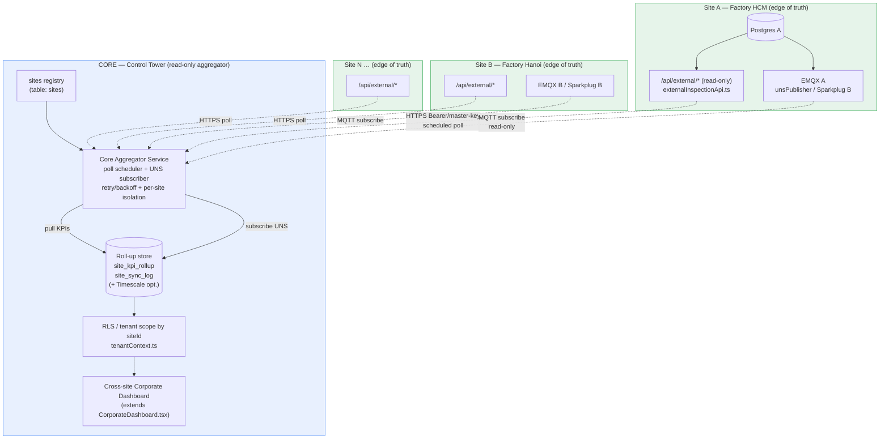
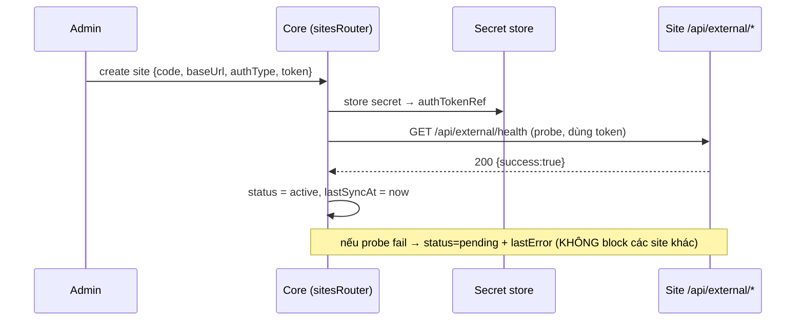
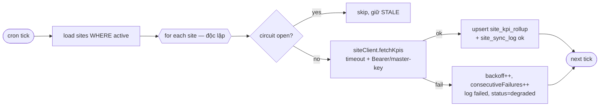

# 13 — Multi-Site Federation Initiative (2026-06)

> Doc 13. Sáng kiến **Federation đa nhà máy** (WS5.2 + WS5.3 AR + WS5.4 Marketplace) cho nền tảng AOI/MES.
> Đây là một sáng kiến **độc lập** với doc-12 (ecosystem unified redesign, P0–P4 đã xong). Doc này nâng cấp
> phần Phase-5 đã phác trong `docs/ECOSYSTEM/PHASE5_FEDERATION_MARKETPLACE.md` thành một **thiết kế + kế hoạch
> build sẵn-sàng-ra-quyết-định**.
>
> Ngày: 2026-06-30. Trạng thái: **DESIGN — chờ duyệt menu dispatch.**

---

## 1. Executive summary — luận điểm edge-to-core

**Luận điểm (federation thesis):**

> **Mỗi site là "edge of truth". Core chỉ tổng hợp read-model — KHÔNG điều khiển site.**

Một tập đoàn vận hành N nhà máy (multi-factory / multi-country). Mỗi nhà máy chạy **một instance đầy đủ** của
nền tảng (DB riêng, EMQX riêng, license riêng) và là **nguồn sự thật cuối cùng** cho dữ liệu của chính nó. Một
instance **core** (control-tower) đứng trên, **kéo (pull)** các read-model KPI/yield/OEE/throughput từ từng site
qua API read-only đã có, và **đăng ký (subscribe)** luồng streaming UNS, gộp vào một **roll-up store** để vẽ
**cross-site corporate dashboard**.

Nguyên tắc bất biến:

1. **Read-only một chiều.** Core **không bao giờ ghi** vào site. Không có command, không có control, không có
   recipe-push từ core. Luồng dữ liệu duy nhất là `site → core`.
2. **Per-site failure isolation.** Một site chết/chậm/đổi token **không** được làm hỏng roll-up của site khác,
   cũng không làm hỏng dashboard. Mọi ô KPI có **trạng thái staleness trung thực** (last-sync, OK/STALE/DOWN).
3. **Degrade trung thực với 1 site.** Toàn bộ framework build được và chạy được với **1 site** (chính bản thân
   instance core có thể tự-enroll như site "local"). Các tính năng *thực sự cross-site* (so sánh ≥2 site,
   ranking) chỉ test đầy đủ khi có ≥2 site sống — doc này nói rõ chỗ nào cần điều đó.

### Tái sử dụng vs làm mới

| Hạng mục | Tái sử dụng (đã có) | Làm mới (build) |
|---|---|---|
| **Data feed per-site** | `server/routes/externalInspectionApi.ts` — ~18 endpoint read-only `/api/external/*` (summary, trend, defect-pareto, control-chart, OEE…) | Thêm 1 endpoint gọn `/api/external/site-kpi-rollup` (tùy chọn — gói KPI 1-call cho aggregator) |
| **Auth per-site** | `server/_core/masterKey.ts` (`MASTER_API_KEY`, constant-time), `validateExternalAuth` (`server/_core/index.ts:1212`), Bearer/x-master-key | Lưu **secret per-site** ở core (`sites.authTokenRef`) + secret store |
| **Streaming** | UNS bridge: `server/services/unsPublisher.ts` + `uns/sparkplugNode.ts` + EMQX (`deploy/emqx/`) | Core **subscriber** đăng ký topic Sparkplug/ISA-95 của site (read-only) |
| **Tenant isolation** | `server/db/tenantContext.ts` (`withTenantScope`/`runWithTenantScope`, RLS GUC), Phase-1 RLS | Mỗi roll-up row mang `siteId` → RLS theo site/corporate ở core |
| **Hierarchy & rollup UI** | `drizzle/schema/hierarchy.ts` (corporates/factories/…), `CorporateDashboard.tsx`, `corporateFactoryStats` router | Thêm **lớp `site`** trên `corporate`, lưới KPI per-site, drill-to-site |
| **Module/licensing** | `shared/module-registry.ts` (SYSTEM_MODULES), `useLicenseModules.ts`, `licenseRouter.ts` | Trang **Modules** (WS5.4) đọc `modulesWithStatus`; `MOD_FEDERATION` mới; note `MOD_ROBOTICS` |

**Tóm lại:** ~70% là **surfacing + glue** quanh hạ tầng đã có (external API, UNS, RLS, hierarchy, license).
Phần mới cốt lõi là: bảng `sites`, **core aggregator service** (poll + subscribe + retry/backoff + staleness),
bảng roll-up, và lớp UI cross-site.

---

## 2. Architecture



**Hai đường nạp dữ liệu (cùng tồn tại, bổ trợ):**

- **Pull (F1, bắt buộc):** Aggregator gọi `/api/external/*` của site theo lịch (vd mỗi 5 phút) → KPI dạng
  bảng (yield/OEE/throughput/defect-pareto theo cửa sổ thời gian). Đơn giản, firewall-friendly (chỉ cần
  site mở HTTPS read-only ra core), độ trễ phút.
- **Subscribe (F3, tùy chọn):** Core là MQTT client đăng ký EMQX của site (hoặc một EMQX-bridge tập trung) để
  nhận telemetry near-real-time (Sparkplug DDATA / topic ISA-95). Chỉ **đọc** — không phát NCMD/DCMD.
  `unsPublisher.ts` đã ghi rõ "publisher CHỈ phát (read-direction)"; phía core ta tái dùng đúng tinh thần đó.

**Per-site isolation:** mỗi roll-up row mang `siteId`. Ở core, đọc đi qua `runWithTenantScope` map
site→corporate; một site lỗi chỉ làm row của nó STALE, không ảnh hưởng query của site khác.

---

## 3. Sites registry — bảng `sites` + enrollment

Bảng mới (migration mới, vd `drizzle/0140_sites_registry.sql`; schema `drizzle/schema/federation.ts`):

```ts
// drizzle/schema/federation.ts (mới)
export const sites = pgTable("sites", {
  id: serial("id").primaryKey(),
  code: varchar("code", { length: 50 }).notNull().unique(),     // "HCM01"
  name: varchar("name", { length: 255 }).notNull(),
  corporateCode: varchar("corporateCode", { length: 50 }),      // FK → corporates.code (rollup parent)
  baseUrl: text("baseUrl").notNull(),                           // https://hcm.factory.local
  region: varchar("region", { length: 100 }),
  country: varchar("country", { length: 100 }),
  timezone: varchar("timezone", { length: 64 }).default("Asia/Ho_Chi_Minh"),
  // --- auth: KHÔNG lưu secret thô; chỉ tham chiếu ---
  authType: varchar("authType", { length: 20 }).default("master_key"), // master_key | bearer
  authTokenRef: varchar("authTokenRef", { length: 128 }),       // key trong secret store (xem §6)
  // --- streaming (F3, optional) ---
  unsBrokerUrl: text("unsBrokerUrl"),                           // mqtt(s)://… của site
  unsTopicPrefix: varchar("unsTopicPrefix", { length: 255 }),   // group_id Sparkplug của site
  // --- vận hành ---
  pollIntervalSec: integer("pollIntervalSec").default(300).notNull(),
  status: varchar("status", { length: 20 }).default("pending").notNull(),
    // pending | enrolling | active | degraded | disabled
  lastSyncAt: timestamp("lastSyncAt"),
  lastSyncStatus: varchar("lastSyncStatus", { length: 20 }),    // ok | partial | failed
  lastError: text("lastError"),
  consecutiveFailures: integer("consecutiveFailures").default(0).notNull(),
  isLocal: boolean("isLocal").default(false).notNull(),         // self-enroll core như 1 site
  isActive: boolean("isActive").default(true).notNull(),
  createdAt: timestamp("createdAt").defaultNow().notNull(),
  updatedAt: timestamp("updatedAt").defaultNow().notNull(),
}, (t) => [
  index("idx_sites_code").on(t.code),
  index("idx_sites_corporate").on(t.corporateCode),
  index("idx_sites_status").on(t.status),
]);
```

**Enrollment flow (1 site mới):**



- Site **phải có** `MASTER_API_KEY` mạnh (không phải default) — `masterKey.ts` đã tự **disable** master-key auth
  ở production nếu để default. Probe là 1 call `/api/external/*` nhẹ (vd `products?limit=1`); nếu chưa có
  `/health` chuyên dụng thì F0 thêm `GET /api/external/health`.
- **Self-enroll local:** core tạo 1 row `isLocal=true` trỏ `baseUrl=http://localhost` để aggregator coi chính
  nó như "Site 0" → dashboard có dữ liệu thật ngay với **1 deployment** (degrade trung thực).

---

## 4. Core aggregator service

File mới: `server/services/federation/aggregator.ts` (+ `siteClient.ts`, `rollupStore.ts`). Cron khởi động ở
`server/_core/index.ts` (giống cron auto-rebuild KB hiện có), flag `FEDERATION_AGGREGATOR_ENABLED` (default OFF).

**Vòng poll (F1):**



Chi tiết:

- **Per-site isolation:** mỗi site chạy trong `try/catch` riêng (`Promise.allSettled`), timeout cứng
  (`AbortController`, vd 15s). Site lỗi → ghi `site_sync_log`, tăng `consecutiveFailures`, **không throw** ra
  vòng ngoài.
- **Retry/backoff + circuit breaker:** backoff mũ có jitter; sau K lần fail liên tiếp (vd 5) → mở circuit, tạm
  bỏ qua site trong cooldown (vd 10 phút), `status=degraded`. Probe lại định kỳ; thành công → reset.
- **Cái gì được pull:** từ `/api/external/*` đã có — `inspections/summary` (yield/OK/NG, throughput),
  `oee` (qua MOD_MONITORING nếu site expose), `defect-pareto` (top defect). Tùy chọn F1+: site expose
  **1 endpoint gói** `GET /api/external/site-kpi-rollup?window=…` trả sẵn KPI tổng hợp cho aggregator (giảm số
  call). Cửa sổ: aggregator xin "từ lastSyncAt" để incremental.
- **Honest staleness:** mỗi row có `asOf` (thời điểm dữ liệu) và `fetchedAt`. UI tính tuổi = `now - fetchedAt`
  → badge OK (<2×interval) / STALE / DOWN (circuit open). **Không bao giờ** lấp số cũ thành "live".
- **UNS subscribe (F3):** `federation/unsSubscriber.ts` — MQTT client tái dùng pattern `unsPublisher.ts`, chỉ
  `subscribe` topic của site (`unsTopicPrefix`), giải mã Sparkplug bằng `uns/sparkplugEncoder.ts`, cập nhật
  roll-up "live" (near-real-time) chèn lên cạnh số poll. Không publish gì.

---

## 5. Cross-site dashboard

Mở rộng `CorporateDashboard.tsx` (giữ nguyên các tab hiện có) + router mới `corporateFactoryStats`-style
`federationRouter`:

- **Site KPI grid (mới):** lưới card per-site — yield%, OEE, throughput hôm nay, NG-rate, **badge staleness**
  (xanh OK / vàng STALE / xám DOWN + "đồng bộ X phút trước"). Đây là bề mặt mang tính *control-tower* đầu tiên.
- **Aggregate roll-up:** tổng/ trung-bình-trọng-số toàn corporate (reuse logic `realAvgOEE`/`corporateOverview`
  hiện có nhưng nguồn là `site_kpi_rollup` thay vì local DB). Khi chỉ 1 site → hiển thị 1 card + ghi chú
  "cross-site comparison cần ≥2 site".
- **Drill to a site:** click card → mở site detail (deep-link `baseUrl` của site, mở app site đó ở cùng route
  history/SPC) HOẶC tab embedded gọi thêm `/api/external/*` chi tiết của riêng site đó.
- **Region/corporate filter:** lọc theo `region`/`corporateCode`; gắn vào `factory-live-map` (3D plant) hiện có
  ở cấp L4 nếu cần "bản đồ nhiều nhà máy".

Gate bằng `MOD_FEDERATION` (mới) qua `useLicenseModules` — chỉ corporate có license federation mới thấy.

---

## 6. Security

- **Auth tới site:** core gọi `/api/external/*` bằng **token của từng site** (`x-master-key` hoặc
  `Authorization: Bearer`). Site validate qua `validateExternalAuth` (`server/_core/index.ts:1212`) +
  `masterKey.ts` (so sánh constant-time; auto-disable nếu default ở prod).
- **Secret storage:** **không** lưu token thô trong `sites`. Lưu **reference** (`authTokenRef`); giá trị nằm ở
  secret store: tối thiểu biến môi trường `SITE_TOKEN_<CODE>`; tốt hơn là KMS/Vault. DB chỉ giữ ref → dump DB
  không lộ secret. Token đi trên **HTTPS** (TLS bắt buộc với site cross-network).
- **RLS ở core:** roll-up row mang `siteId/corporateCode`; đọc đi qua `runWithTenantScope` (map user→corporate
  scope) — user của corporate này không thấy roll-up của corporate khác. Bật cùng `TENANT_RLS_ENABLED` như
  Phase-1.
- **Read-only guarantee (cứng):** aggregator chỉ dùng **GET** `/api/external/*` và MQTT **subscribe**. Không có
  code path nào ở core ghi tới site. UNS subscriber **không** đăng ký/không phát NCMD/DCMD (đúng như
  `unsPublisher.ts` ghi: read-direction). Lệnh ghi (nếu sau này có) phải là sáng kiến riêng, HITL+interlock,
  ngoài phạm vi doc này.
- **Least privilege:** khuyến nghị site cấp token **chỉ-đọc-analytics** riêng cho core (không dùng chung master
  key vận hành), revoke độc lập per-site.

---

## 7. WS5.4 — Marketplace & Modules page

Phần lớn đã có (xem `PHASE5_FEDERATION_MARKETPLACE.md` §WS5.4). Việc còn lại **mỏng**:

- **Trang `/modules`** (mới, read-only): liệt kê `SYSTEM_MODULES` với trạng thái licensed/locked lấy từ
  `useLicenseModules().modulesWithStatus` (đã trả sẵn `{...module, allowed}`). Mỗi module: tên, mô tả,
  version, badge **Đã cấp phép / Khóa**, link "liên hệ nâng cấp". Không cần endpoint mới — dữ liệu đã có.
- **Module mới:** thêm `MOD_FEDERATION` vào `shared/module-registry.ts` (routes `/federation-dashboard`,
  `/sites`, `/modules`; feature `FEDERATION_DASHBOARD`, `FEDERATION_SITES_MANAGE`). Chạy `export-modules.ts`
  để đồng bộ License Server (`scripts/export-modules.ts`).
- **Note `MOD_ROBOTICS`:** khi UI robotics (doc-09 device-programming) ra mắt, đóng gói thành `MOD_ROBOTICS`
  (routes robot programming/teach/jog) — chỉ là thêm 1 entry vào `SYSTEM_MODULES` + license; trang Modules
  tự hiện. Chưa làm bây giờ (chờ UI robotics land).

---

## 8. WS5.3 — AR / HMI guided assembly (design-only, DEFERRED)

Giữ nguyên lập trường `PHASE5_FEDERATION_MARKETPLACE.md`: **deferred — cần phần cứng AR + UI tác giả bước**.
Tóm tắt thiết kế:

- **Nguồn bước (step source):** tái dùng `measurement_point_defs` (điểm đo + ROI + ảnh tham chiếu) làm danh sách
  bước; defect-catalog làm tiêu chí pass/fail.
- **Trigger:** pipeline Computer-Vision (ROI/defect detection) hiện có làm tín hiệu "bước OK → bước kế".
- **Delivery:** tablet overlay hoặc WebXR; với robot-guided thì CV→pose (hand-eye calibration, follow-up
  Phase-3) feed cùng step model.
- **Vì sao defer:** cần (1) phần cứng AR/HMI, (2) một **guided-step authoring UI**, (3) hiệu chuẩn. Không có
  blocker nào từ federation; chỉ làm khi có hardware + nhu cầu thật. **F4 = chỉ thiết kế, không code.**

---

## 9. Data model & scale

**Bảng roll-up (core):**

```ts
// site_kpi_rollup — 1 row / (site, metricWindow, bucket)
siteId, corporateCode, window ("day"|"shift"|"hour"),
bucketStart (timestamp), yieldRate, okCount, ngCount, throughput,
oee, ngRatePareto (jsonb top-N), asOf, fetchedAt, source ("poll"|"uns")
// PK/uniq (siteId, window, bucketStart); index (corporateCode, bucketStart)

// site_sync_log — audit mỗi lần poll/subscribe (per-site isolation, debug staleness)
siteId, startedAt, finishedAt, status ("ok"|"partial"|"failed"),
endpointsHit (jsonb), rowsUpserted, errorMessage
```

- **Retention:** `site_kpi_rollup` là *aggregate* (không phải raw inspection) → nhỏ. Giữ daily vô hạn,
  hour/shift vài tháng; `site_sync_log` xoay vòng 30–90 ngày (cron prune).
- **Many sites:** poll N site song song có giới hạn concurrency (vd p-limit 8); chi phí ~ N × số-endpoint /
  interval. Roll-up là số tổng hợp nên N=50 site vẫn nhẹ.
- **Timescale tùy chọn:** dự án đã có **DB time-series chuyên dụng** (Timescale, dùng cho telemetry/UNS — xem
  `drizzle/0132_unified_telemetry.sql`). Nếu cần roll-up **theo phút near-real-time** (đường UNS F3),
  đặt `site_kpi_rollup` (hoặc 1 hypertable `site_kpi_ts`) trên Timescale đó để hưởng continuous-aggregate +
  retention policy. Đường poll (F1) đặt ở Postgres core là đủ. **Quyết định ở §12.**

---

## 10. Phased plan

| Phase | Nội dung | Exit criteria |
|---|---|---|
| **F0 — Sites registry + enrollment** | Schema `sites` + migration; `sitesRouter` CRUD; secret-ref; probe `/api/external/health`; self-enroll local; trang `/sites` quản lý | Tạo/sửa/xóa site; probe 1 site (chính core qua local) trả OK; secret không lưu thô; status hiển thị đúng |
| **F1 — Aggregator (pull)** | `federation/aggregator.ts` + `siteClient.ts` + `rollupStore.ts`; bảng `site_kpi_rollup`/`site_sync_log`; cron + flag; retry/backoff/circuit; staleness; (opt) `/api/external/site-kpi-rollup` | Poll local site điền `site_kpi_rollup`; 1 site fail không hỏng vòng; `lastSyncAt`/`lastError` đúng; backoff hoạt động; bật/tắt bằng flag |
| **F2 — Cross-site dashboard** | Mở rộng `CorporateDashboard.tsx` + `federationRouter`; site KPI grid + badge staleness; aggregate roll-up; drill-to-site; gate `MOD_FEDERATION` | Grid hiển thị ≥1 site với số thật từ roll-up; badge staleness đúng; drill mở site detail; degrade rõ ràng khi 1 site |
| **F3 — UNS streaming + Modules page** | `federation/unsSubscriber.ts` (subscribe-only, Sparkplug decode); near-real-time vào roll-up; trang `/modules` (WS5.4); `MOD_FEDERATION`/`MOD_ROBOTICS` registry | Core subscribe EMQX 1 site, cập nhật roll-up "live"; không phát command nào (verify); trang Modules liệt kê licensed/locked đúng từ `useLicenseModules` |
| **F4 — AR design** | Chỉ tài liệu thiết kế guided-step + CV-trigger + authoring UI spec (không code) | Doc design AR review xong; xác nhận blocker phần cứng; backlog tách riêng |

**Cần ≥2 site sống để test đầy đủ:** F2 (so sánh/ranking cross-site) và F3 (đa broker). F0/F1 test được với 1
deployment qua self-enroll local. Mọi phase build sao cho **chạy + degrade trung thực với 1 site**.

---

## 11. Implementation agent dispatch plan (menu để duyệt)

Mỗi phase = 1 hoặc vài sub-agent chuyên trách. Thứ tự trong phase là thứ tự dispatch.

### F0 — Sites registry + enrollment
1. **schema-agent** — *mission:* tạo `drizzle/schema/federation.ts` (`sites`) + migration `drizzle/0140_sites_registry.sql` + export ở `drizzle/schema/index.ts`. *targets:* `drizzle/schema/federation.ts`, `drizzle/0140_*.sql`, `drizzle/schema/index.ts`.
2. **backend-agent** — *mission:* `sitesRouter` (CRUD + probe + self-enroll local) + secret-ref helper (`server/services/federation/secretStore.ts`) + endpoint `GET /api/external/health`. *targets:* `server/routers/sitesRouter.ts`, `server/routers.ts` (đăng ký), `server/services/federation/secretStore.ts`, `server/routes/externalInspectionApi.ts` (health).
3. **frontend-agent** — *mission:* trang `/sites` quản lý + form enroll + status/probe UI. *targets:* `client/src/pages/SitesManagement.tsx`, route + nav.

### F1 — Aggregator (pull)
1. **schema-agent** — `site_kpi_rollup` + `site_sync_log` (migration `0141`). *targets:* `drizzle/schema/federation.ts`, `drizzle/0141_*.sql`.
2. **backend-agent (core)** — `aggregator.ts` + `siteClient.ts` + `rollupStore.ts` (poll, timeout, retry/backoff, circuit, isolation, staleness) + cron + flag `FEDERATION_AGGREGATOR_ENABLED` ở `server/_core/index.ts`. *targets:* `server/services/federation/*.ts`, `server/_core/index.ts`, `server/_core/env.ts`.
3. **backend-agent (feed, opt.)** — endpoint gói `/api/external/site-kpi-rollup`. *targets:* `server/routes/externalInspectionApi.ts`.
4. **test-agent** — unit: isolation (1 site fail), backoff/circuit, staleness math. *targets:* `server/services/federation/aggregator.test.ts`.

### F2 — Cross-site dashboard
1. **backend-agent** — `federationRouter` (site KPI grid, aggregate, drill). *targets:* `server/routers/federationRouter.ts`, `server/routers.ts`.
2. **frontend-agent** — mở rộng `CorporateDashboard.tsx` (site grid + staleness badge + drill) hoặc trang `/federation-dashboard`. *targets:* `client/src/pages/CorporateDashboard.tsx` (hoặc `FederationDashboard.tsx`), components.
3. **license-agent** — thêm `MOD_FEDERATION` + gate. *targets:* `shared/module-registry.ts`, chạy `scripts/export-modules.ts`.

### F3 — UNS streaming + Modules page
1. **backend-agent (uns)** — `federation/unsSubscriber.ts` (subscribe-only, reuse `uns/sparkplugEncoder.ts`). *targets:* `server/services/federation/unsSubscriber.ts`, wiring ở `_core/index.ts`, flag.
2. **frontend-agent** — trang `/modules` từ `useLicenseModules().modulesWithStatus`. *targets:* `client/src/pages/ModulesPage.tsx`, route + nav.
3. **security-agent (verify)** — xác nhận không có code path ghi/command tới site. *targets:* review `federation/*`.

### F4 — AR design
1. **doc-agent** — viết design AR (step source, CV-trigger, authoring UI) vào doc riêng. *targets:* `docs/ECOSYSTEM/13b_AR_GUIDED_ASSEMBLY_DESIGN.md`.

---

## 12. Open decisions (cần user chốt)

1. **Topology core:** Core là **instance riêng** (deployment thứ N+1) hay **một site cũng kiêm core**? Khuyến
   nghị: instance riêng cho cô lập, nhưng self-enroll-local cho phép thử trên 1 deployment trước.
2. **Pull vs Subscribe trước:** Làm F1 (pull, đơn giản, đủ cho dashboard phút) trước rồi mới F3 (UNS
   near-real-time)? Khuyến nghị **có** — pull mang lại 90% giá trị control-tower với ít rủi ro.
3. **Roll-up store:** Postgres core (đơn giản) hay đặt time-series lên **Timescale dedicated** đã có? Khuyến
   nghị: F1 dùng Postgres core; chuyển/đặt Timescale **chỉ** khi F3 cần near-real-time theo phút.
4. **Secret store:** đủ dùng `SITE_TOKEN_<CODE>` env (đơn giản, hợp với deployment hiện tại) hay cần KMS/Vault
   ngay? Khuyến nghị: env-ref cho F0/F1, nâng KMS khi nhiều site/production cross-network.
5. **Token per-site:** site cấp **token chỉ-đọc-analytics riêng cho core**, hay tái dùng `MASTER_API_KEY` vận
   hành? Khuyến nghị: token riêng, revoke độc lập.
6. **Drill-to-site:** deep-link sang app của site (đơn giản, đúng "edge of truth") hay embed/proxy chi tiết
   trong core? Khuyến nghị: deep-link trước; embed sau nếu cần SSO xuyên site.
7. **Scope cấp roll-up:** chốt lớp `site` nằm **trên** `corporate` hay **song song**? (`sites.corporateCode`
   gắn site vào corporate hiện có — cần xác nhận một corporate có thể trải nhiều site và ngược lại không.)
8. **License gating:** federation là `MOD_FEDERATION` (license riêng) hay gộp vào `MOD_CORPORATE` đã có?
   Khuyến nghị: module riêng để bán/khoá độc lập.

---

*Hết doc 13. Sau khi duyệt menu §11 + chốt §12, dispatch theo thứ tự F0 → F4.*
