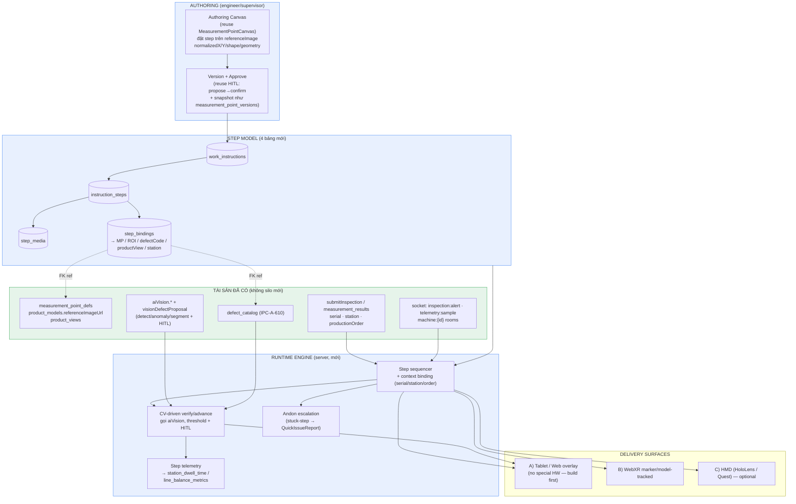
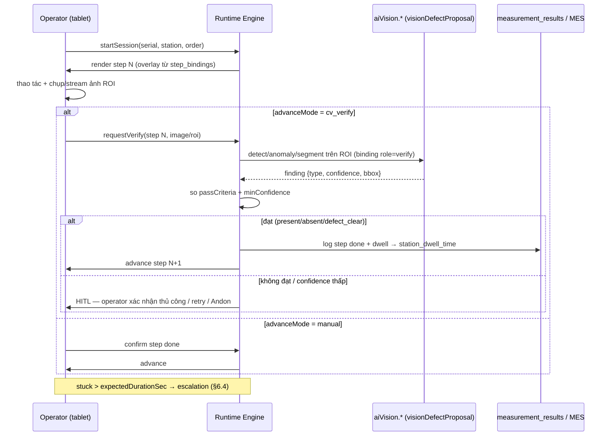

# 14 — AR / HMI Guided Assembly — Detailed Design (2026-06)

> Doc 14. Thiết kế chi tiết **AR / HMI Guided Assembly** — Phase 5 **WS5.3** / Federation **F4**.
> Đây là **DESIGN-ONLY** (không code, không migration). Mục tiêu: một thiết kế **đủ chi tiết để build sau**.
>
> Ngày: 2026-06-30. Branch: `federation-initiative`. Trạng thái: **DESIGN — chờ duyệt menu dispatch (§12).**
>
> Nâng cấp phần tóm tắt WS5.3 trong `docs/ECOSYSTEM/PHASE5_FEDERATION_MARKETPLACE.md` (§WS5.3) và
> `docs/ECOSYSTEM/13_FEDERATION_INITIATIVE_2026-06.md` (§8 + F4 dispatch) thành thiết kế ra-quyết-định.

---

## 1. Executive summary — luận điểm "tái sử dụng, không xây thế giới authoring mới"

**AR-Guided Assembly là gì:** một lớp **hướng dẫn lắp ráp/thao tác trực quan, theo từng bước**, phủ
(overlay) lên **ảnh tham chiếu sản phẩm** (hoặc khung hình live qua camera/WebXR), dẫn dắt operator làm
đúng thứ tự, và **dùng chính pipeline Computer-Vision đang có làm cảm biến xác nhận bước** ("bước này đã
làm đúng chưa?"). Giá trị: **giảm lỗi thao tác, rút ngắn đào tạo (onboarding), chuẩn hoá tay nghề**, và —
khi có CV-verify — **poka-yoke** (chặn lỗi tại nguồn) thay vì chỉ phát hiện sau.

**Luận điểm cốt lõi (reuse thesis):**

> **Nền tảng ĐÃ CÓ sẵn "bộ xương" của một hệ guided-assembly. Ta KHÔNG xây một thế giới authoring mới —
> ta thêm một lớp mỏng "step + binding + runtime" lên trên các tài sản đã có.**

| Khái niệm AR-guided | Tài sản đã có để tái dùng | File / bảng (cite) |
|---|---|---|
| **Step anchor** (neo bước trên ảnh) | `measurement_point_defs` — đã có `normalizedX/normalizedY/normalizedRadius`, `positionX/Y/radius`, `shape` (circle/rect/polygon/line), `geometry` jsonb, `cropWidth/cropHeight`, `orderIndex` | `drizzle/schema/product.ts:96–208` |
| **Overlay canvas** (nền vẽ) | `product_models.referenceImageUrl` + `imageWidth/imageHeight` + `imageDisplayMode` + `coordinateMode` (pixel\|mm); và **multi-view** `product_views` (top/bottom/side/iso) | `drizzle/schema/product.ts:8–47`, `product_views:522–545` |
| **Failure modes** (tiêu chí pass/fail) | `defect_catalog` — `code`, `severity`, `ipcReference`, `ipcSection`, `classRules` (Class 2/3), `appliesTo`, `detectableBy` (IPC-A-610, P4) | `drizzle/schema/product.ts:316–372` |
| **CV trigger / verify** | `visionDefectProposal.ts` (`mapVisionFindingToDefect`, finding→defect, **HITL**), `aiVisionRouter` (`aiVision.advanced/anomaly/segmentation/imageSearch/language`, `suggestDefectCodes`, `proposeDefect`) | `server/services/visionDefectProposal.ts`, `server/routers/aiVisionRouter.ts` |
| **Bind serial/station/order** | `submitInspection` (serial, productModel, station/line/stage, productionOrderCode, operatorId), `station_dwell_time`, `line_balance_metrics`, `station_traces` | `server/routers/machineApiRouters.ts:81–200`, `drizzle/schema/mes.ts:56–105`, `product.ts:969` |
| **Overlay rendering pattern** | Heatmap đã render bubble theo `normalizedX/Y * 100%` trên ảnh tham chiếu — **chính cơ chế overlay ta cần** | `client/src/components/ProductDefectHeatmap.tsx`, `client/src/components/measurement-point-canvas/MeasurementPointCanvas.tsx` |
| **HITL / approval** | `propose → confirm → execute` (aiCopilotActions), `threshold_approvals`, `measurement_point_versions` (snapshot lịch sử), robot job dry-run gate | `visionDefectProposal.ts:376`, `drizzle/schema/product.ts:219–234, 878–904` |
| **Operator surface** | `/operator` kiosk shell (tiles ≥96px, TodayBriefing, MachineQuickScan QR, QuickIssueReport→Andon, AIActionInbox 1-tap); Ops war-room | `client/src/pages/OperatorHome.tsx`, `client/src/pages/OpsConsole.tsx` |
| **Andon** | `andonRouter.quickReport` (AI-classified, RBAC `andon/canCreate`) → `raiseAndon`; channel `andon:event` | `server/routers/andonRouter.ts`, `server/services/andon/andonService.ts` |
| **Realtime** | socket `inspection:alert`, `telemetry:sample`, `andon:event`, `machine:{id}`/`line:{id}` rooms; `useSocket`, `useRealtimeDashboard` | `server/_core/socket.ts:663–739`, `client/src/hooks/useSocket.ts` |
| **HITL** | `aiCopilot.confirmAction/cancelAction` (token+actionId, TTL); 21 CFR Part 11 sign-off (`productionSessions.signoffSignature` HMAC) | `server/routers/aiCopilotRouter.ts`, `drizzle/schema/production.ts` |
| **i18n / RBAC** | `react-i18next` (`useTranslation`/`t()`, vi/en/zh, fallback vi); `roleProcedure(...)`/`operatorProcedure`/`qualityProcedure`/`supervisorProcedure` + `requirePermission(module, action)` | `client/src/i18n/index.ts`, `server/_core/trpc.ts:120–194`, `server/_core/accessControl.ts` |

**Kết luận:** phần thực sự MỚI chỉ là **4 bảng** (`work_instructions`, `instruction_steps`, `step_media`,
`step_bindings`), một **runtime engine**, một **authoring UI** (kế thừa canvas measurement-point đã có), và
các **delivery surface** (tablet trước, WebXR/HMD sau). Ước tính **~65–70% là glue/reuse**.
**Hiện trạng:** grep `work_instruction`/`guided`/`sop` trong `drizzle/` = **0 kết quả** → đây là greenfield
sạch cho 4 bảng mới, không đụng schema cũ.

---

## 2. Use cases & personas

Vai trò lấy từ `server/_core/trpc.ts:150` (`admin | supervisor | quality_inspector | operator | maintenance | viewer | user`).

| Persona | Vai trò RBAC | Use case AR-guided | Surface |
|---|---|---|---|
| **Operator** | `operator` | Được dẫn từng bước lắp ráp/thao tác theo serial đang chạy; nhìn overlay "đặt linh kiện X vào ROI này", bước tự **advance** khi CV xác nhận; bí thì 1-tap Andon | Tablet `/operator` shell |
| **Quality / Inspector** | `quality_inspector` | Khi inspection ra **NG**, hệ tạo **rework guidance**: overlay vị trí lỗi (bbox từ `measurement_results`) + bước sửa theo `defect_catalog.code`; sau sửa CV **re-verify "defect-clear"** | Tablet + web overlay |
| **Engineer / Process** | `supervisor` (author), `engineer` map về supervisor scope | **Author** work instruction: đặt step lên ảnh tham chiếu bằng cùng `normalizedX/Y`, gắn media/text, set pass-criteria + CV trigger, **version + approve** | Authoring UI (desktop) |
| **Maintenance** | `maintenance` | Guided **procedure** bảo trì/đổi khuôn/setup (checklist có ảnh + xác nhận), không nhất thiết CV — manual-advance | Tablet |
| **Supervisor / Viewer** | `supervisor` / `viewer` | Supervisor duyệt instruction + xem step-timing analytics; viewer chỉ xem read-only | Web |

**Nguyên tắc:** mỗi surface **enforce RBAC theo procedure** (author = `supervisor`+; chạy = `operator`+;
verify-defect = `qualityProcedure` đúng như `visionDefectProposal` đang dùng `history_correct`).

---

## 3. Architecture

**Cách "cắm" vào hệ thống mà không tạo silo:** step model chỉ **tham chiếu** (FK mềm) tới
`measurement_point_defs`, `defect_catalog`, `product_models/product_views` — KHÔNG nhân bản dữ liệu. Runtime
**đọc** context từ `submitInspection`/`measurement_results` và **gọi** `aiVision.*` để verify; nó **ghi**
step-timing vào bảng MES đã có (`station_dwell_time`, `line_balance_metrics`). Andon tái dùng
`QuickIssueReport`. Realtime tái dùng room `machine:{id}` + channel `inspection:alert`.

---

## 4. Guided-step data model (4 bảng mới — design, không SQL)

Schema mới đề xuất: `drizzle/schema/workInstructions.ts`, migration mới (vd `drizzle/0142_work_instructions.sql`),
export ở `drizzle/schema/index.ts`. Tất cả theo **convention hiện hữu**: `serial id`, `createdAt/updatedAt`,
`deletedAt` soft-delete, `isActive`, index theo FK (giống `product.ts`).

### 4.1 `work_instructions` — đầu mục instruction (versioned + approval)
| Field | Kiểu | Ý nghĩa |
|---|---|---|
| `id` | serial PK | |
| `code` | varchar(50) unique | mã instruction (vd "WI-PCBA-TOP-001") |
| `name`, `description` | varchar/text | |
| `productModelId` | integer (FK mềm → product_models.id) | instruction gắn 1 product model |
| `productViewId` | integer NULL (FK → product_views.id) | view nền (top/bottom/side); NULL = view mặc định |
| `kind` | varchar(20) | `assembly` \| `rework` \| `maintenance` \| `setup` \| `inspection_aid` |
| `triggerDefectCode` | varchar(50) NULL (→ defect_catalog.code) | với `kind=rework`: instruction này kích hoạt khi gặp defect-code này |
| `stationCode` | varchar(50) NULL | trạm áp dụng (khớp `submitInspection.stageCode`/`station_dwell_time`) |
| `version` | integer default 1 | tăng mỗi lần publish |
| `status` | varchar(20) | `draft` \| `pending_approval` \| `approved` \| `published` \| `archived` |
| `approvedBy`, `approvedAt` | integer/timestamp | reuse pattern `threshold_approvals` |
| `effectiveFrom`, `effectiveTo` | timestamp NULL | hiệu lực |
| `isActive`, `deletedAt`, `createdBy`, `createdAt`, `updatedAt` | | |

### 4.2 `instruction_steps` — từng bước (ordered)
| Field | Kiểu | Ý nghĩa |
|---|---|---|
| `id` | serial PK | |
| `workInstructionId` | integer (FK) | |
| `stepNo` | integer | thứ tự (giống `orderIndex`) |
| `code`, `title` | varchar | |
| `instructionText` | text | hướng dẫn (i18n: + `instructionTextVi/En/Zh` hoặc jsonb `i18n`) |
| `expectedDurationSec` | integer NULL | dùng cho stuck-detection + line-balance |
| `advanceMode` | varchar(20) | `manual` \| `cv_verify` \| `cv_or_manual` \| `timer` |
| `passCriteria` | jsonb | mượn shape `measurement_point_defs.criteria`; discriminated union (presence/absence/defect-clear/measurement-in-tol) |
| `cvTrigger` | jsonb NULL | cấu hình CV: `{ tool: "anomaly"\|"segmentation"\|"advanced"\|"vision_language", roiBindingId, minConfidence, expect: "present"\|"absent"\|"defect_clear", defectCodes?: string[] }` |
| `onFailAction` | varchar(20) | `retry` \| `andon` \| `block` \| `flag_ng` |
| `isOptional` | boolean | |
| `isActive`, `deletedAt`, `createdAt`, `updatedAt` | | |

### 4.3 `step_media` — media đính kèm step (text/image/video/3D/overlay)
| Field | Kiểu | Ý nghĩa |
|---|---|---|
| `id` | serial PK | |
| `stepId` | integer (FK) | |
| `mediaType` | varchar(20) | `image` \| `video` \| `gif` \| `pdf` \| `model3d` \| `overlay_svg` \| `audio` |
| `url`, `storageKey` | text/varchar | reuse pattern `referenceImageUrl/referenceImageKey` |
| `caption` | text (i18n) | |
| `orderIndex` | integer | |
| `overlayGeometry` | jsonb NULL | hình vẽ chỉ dẫn (mũi tên/vùng) theo normalized coords, cùng hệ với canvas |
| `isActive`, `deletedAt`, `createdAt` | | |

### 4.4 `step_bindings` — neo step vào tài sản thật (cốt lõi của reuse)
Một step có **N bindings**. Mỗi binding nối step tới **một** anchor cụ thể:

| Field | Kiểu | Ý nghĩa |
|---|---|---|
| `id` | serial PK | |
| `stepId` | integer (FK) | |
| `bindingType` | varchar(20) | `measurement_point` \| `roi` \| `defect_code` \| `fiducial` \| `region` |
| `measurementPointDefId` | integer NULL (→ measurement_point_defs.id) | neo vào điểm đo đã có (kế thừa toạ độ + ROI + criteria) |
| `defectCatalogId` | integer NULL (→ defect_catalog.id) | failure mode (rework target / verify expect) |
| `productViewId` | integer NULL | binding theo view nào |
| `normalizedX`, `normalizedY` | decimal(10,8) NULL | **dùng KHI binding là ROI tự do** (không qua MP); **cùng đơn vị heatmap/MP** |
| `normalizedRadius` | decimal(10,8) NULL | |
| `shape` | varchar(20) | `circle`\|`rect`\|`polygon`\|`line` (giống MP) |
| `geometry` | jsonb NULL | payload shape (giống `measurement_point_defs.geometry`) |
| `role` | varchar(20) | `target` (chỗ làm) \| `verify` (chỗ CV kiểm) \| `reference` |
| `createdAt` | | |

**Quy tắc binding (ưu tiên reuse):**
- Nếu step trỏ vào một điểm đã định nghĩa → set `measurementPointDefId` (kế thừa toạ độ, ROI, `criteria`,
  `cropWidth/Height`). **Không** lưu lại toạ độ.
- Nếu step cần ROI **tự do** (không có MP) → set `normalizedX/Y` + `shape/geometry` trực tiếp, **đúng hệ
  toạ độ heatmap** (`ProductDefectHeatmap.tsx` filter `normalizedX/Y ∈ [0,1]` → render `* 100%`).
- Rework step → `bindingType=defect_code` + `defectCatalogId` (verify = "defect cleared").

### 4.5 Versioning & approval (reuse pattern, không phát minh mới)
- **Version:** `work_instructions.version` tăng khi publish; có thể thêm `instruction_step_versions`
  snapshot **giống hệt** `measurement_point_versions` (`drizzle/schema/product.ts:219–234`:
  `snapshotJson`, `changedBy`, `changeReason`, `version` monotonic).
- **Approval:** mượn `threshold_approvals` lifecycle (`requested → approved/rejected → applied`,
  `decidedBy/decidedAt`) — instruction phải `approved` trước khi `published`. Author không tự approve
  (RBAC: author=`supervisor`, approve=`supervisor`/`admin` khác người, ghi audit).

---

## 5. Authoring UI (engineer)

**Tái dùng canvas đã có:** `client/src/components/measurement-point-canvas/MeasurementPointCanvas.tsx`
(đã hỗ trợ multi-shape: circle/rect/polygon/line, zoom, transform toạ độ) + pattern overlay của
`ProductDefectHeatmap.tsx`. Authoring = một chế độ "step layer" trên cùng canvas đó.

Luồng author (`/work-instructions/:id/author`, gate `supervisorProcedure`):
1. Chọn `productModel` + `productView` → tải `referenceImageUrl` (`imageWidth/imageHeight`,
   `imageDisplayMode`) làm nền.
2. **Thêm step:** đặt anchor lên ảnh — click vào một `measurement_point_defs` đã có (snap → tạo
   `step_binding(measurement_point)`), HOẶC vẽ ROI tự do (lưu `normalizedX/Y/shape/geometry`). **Cùng hệ
   normalized** nên anchor khớp tuyệt đối với heatmap/MP hiện có.
3. **Gắn nội dung:** text (i18n qua `react-i18next`), media (`step_media`: ảnh/video/3D/overlay SVG mũi tên).
4. **Set pass criteria + CV trigger:** chọn `advanceMode`; nếu `cv_verify` → cấu hình `cvTrigger`
   (tool = `anomaly/segmentation/advanced/vision_language`, `minConfidence`, `expect`, `defectCodes` từ
   `defect_catalog` qua `aiVision.defectCodes`/`suggestDefectCodes`).
5. **Sequence:** kéo-thả `stepNo`.
6. **Version + Approve:** submit `pending_approval` → người khác `approve` (HITL) → `publish`
   (snapshot `instruction_step_versions`).

Read-only enforcement: viewer/operator mở authoring = chỉ xem (giống doc 10 yêu cầu enforce read-only).

---

## 6. Runtime engine (server, mới: `server/services/guidedAssembly/`)

Files đề xuất: `runtimeEngine.ts`, `stepVerifier.ts`, `sessionStore.ts`; router
`server/routers/guidedAssemblyRouter.ts`; cron/flag `GUIDED_ASSEMBLY_ENABLED` (default OFF, theo convention).

**Một session = (workInstructionId, serialNumber, stationCode, productionOrderCode?, operatorId).** Context
lấy từ `submitInspection` input shape (`machineApiRouters.ts:81`: serial, productModel, stage/line,
productionOrderCode, operatorId) hoặc từ QR scan (`MachineQuickScan`).

### 6.1 Step sequencing
Theo `stepNo`; bỏ qua `isOptional` nếu operator chọn; hỗ trợ quay lại bước trước (rework). Trạng thái
session lưu in-memory + persist tối thiểu (resume khi mất kết nối — reuse PWA offline pattern doc WS5.1).

### 6.2 CV-driven advance/verify
- `stepVerifier.ts` gọi `aiVision.advanced/anomaly/segmentation` (qua `aiVisionRouter`) trên ROI của
  binding `role=verify`. Map finding→ý nghĩa bước: `expect:"present"` (linh kiện đã đặt),
  `"absent"` (đã gỡ/làm sạch), `"defect_clear"` (lỗi đã hết → re-verify sau rework).
- **Defect→rework:** dùng `mapVisionFindingToDefect` (`visionDefectProposal.ts:97`) để match finding với
  `defect_catalog`; nếu khớp `step.cvTrigger.defectCodes` → bước CHƯA pass.
- **Ngưỡng & HITL:** `minConfidence` per-step; dưới ngưỡng → **không tự advance**, hỏi operator (đúng tinh
  thần `visionDefectProposal`: vision **không bao giờ ghi trực tiếp**, luôn qua xác nhận). Việc ghi NG (nếu
  `onFailAction=flag_ng`) đi qua **đúng** `aiVision.proposeDefect` (HITL `propose→confirm`).

### 6.3 Manual override
Mọi bước `cv_verify` luôn có nút "Xác nhận thủ công" (operator có quyền override khi CV sai/không khả dụng),
ghi `overrideBy` + lý do vào step-log (audit). Đây là an toàn vận hành bắt buộc.

### 6.4 Telemetry & Andon
- **Step timing:** mỗi bước ghi dwell → **bảng MES đã có** `station_dwell_time`
  (`drizzle/schema/mes.ts:56`; có sẵn `dwellMs/processingMs/starvedMs/blockedMs/enteredAt/exitedAt`) và
  roll-up `line_balance_metrics` (`:84`) qua write-path `wipIngestService.ingestInspectionToWip` →
  feed cân bằng chuyền hiện hữu, không phát minh đường ghi mới.
- **Realtime:** phát qua `socket` room `machine:{id}` (channel mới `guided:step` hoặc tái dùng pattern
  `emitTelemetrySamples`/`inspection:alert` ở `server/_core/socket.ts:663–739`).
- **Stuck escalation:** quá `expectedDurationSec` × hệ số → tạo Andon qua `andonRouter.quickReport`
  (AI-classified, `raiseAndon`), hiển thị trên `/operator`/`OpsConsole` + đẩy `andon:event`/`inspection:alert`
  cho supervisor (giống NG_ALERT).

---

## 7. Delivery surfaces

| Surface | Cần gì | Pros | Cons |
|---|---|---|---|
| **(a) Tablet / Web overlay** (DOM/SVG/Canvas trên `referenceImageUrl`, dùng `normalizedX/Y`) | Chỉ tablet + camera thường (chụp ROI để CV). **Zero special HW.** | Build ngay; tái dùng 100% canvas + heatmap pattern; chạy trong `/operator` PWA; offline-friendly | Không "dán" overlay lên vật thật theo không gian (2D trên ảnh, không tracking) |
| **(b) WebXR — marker hoặc model-tracked** | Trình duyệt hỗ trợ WebXR + camera; thư viện AR.js/MindAR (marker) hoặc model-tracking; fiducial (`fiducial_marks` đã có ở `product.ts:57`) làm anchor | Overlay "dán" lên board thật; vẫn web (không app store) | Tracking dễ trôi với vật nhỏ/đa dạng; cần ánh sáng tốt; calibrate camera; lib + hiệu năng |
| **(c) HMD (HoloLens 2 / Quest 3)** | Kính + app (WebXR trên Quest browser hoặc native); spatial anchor | Rảnh tay (hands-free) — lý tưởng lắp ráp; depth/spatial thực | Đắt, nặng đầu tư, bảo trì thiết bị, vệ sinh, đào tạo; ROI chỉ rõ với thao tác phức tạp |

**Khuyến nghị: TABLET-FIRST.** Surface (a) mang **phần lớn giá trị** (guided steps + CV-verify + rework
guidance + poka-yoke qua camera cố định) **mà không cần phần cứng AR**. WebXR/HMD là nâng cấp khi có nhu
cầu "dán overlay 3D lên vật thật" và ngân sách.

---

## 8. CV / Vision integration

Tái dùng nguyên trạng, **không** thêm model mới ở phase đầu:
- **Detection → step verify:** `stepVerifier` gọi `aiVision.advanced/anomaly/segmentation` trên ROI binding;
  so `passCriteria` (present/absent/defect_clear) + `minConfidence`.
- **Defect → rework guidance:** finding text → `mapVisionFindingToDefect` → `defect_catalog` (IPC-A-610,
  `classRules` Class 2/3) → chọn `work_instructions(kind=rework, triggerDefectCode=…)` → overlay bbox lỗi
  (lấy `defectBboxX/Y/W/H` trên `measurement_results`, xác nhận từ Explore) + step sửa.
- **Confidence + HITL (bắt buộc):** ngưỡng per-step; dưới ngưỡng KHÔNG auto-advance. Ghi NG luôn qua
  `aiVision.proposeDefect` (`aiVisionRouter.ts:98`) → `propose→confirm→execute`, RBAC `history_correct`
  (= `qualityProcedure`). **Vision không bao giờ ghi trực tiếp** (đúng nguyên tắc `visionDefectProposal.ts`).
- **Latency:** xem §13 — on-device (chụp→upload→server CV) vs edge CV.

---

## 9. Robotics tie-in (CV → pose) — honest deferral

Phase 3 (`docs/ECOSYSTEM/PHASE3_ROBOTICS.md`) đã có registry robot + dispatcher gated (HITL → dry-run mặc
định → `robot_jobs` append-only) cho `sim/Fanuc/Mitsubishi/Delta/Techman`. **CV→pose (hand-eye
calibration) là follow-up đã ghi rõ "deferred"** (PHASE3 §Deferred + §Safety: "Vision-guided motion should
pass target poses as job `params`; CV→pose mapping là follow-up").

**Cách AR-guided sẽ nối (khi làm A3):** một step `assist` có `cvTrigger` xác định vị trí (bbox/centroid từ
segmentation) → qua **hand-eye calibration** chuyển toạ độ ảnh → pose robot → đẩy vào `dispatchRobotJob`
**params** (HITL + dry-run + `ROBOT_CONTROL_ENABLED` gate). **Cùng step model** — không nhánh riêng.

**Thành thật:** cần (1) hand-eye calibration thật, (2) test cell có bảo vệ, (3) robot driver thật (hiện
là scaffold `throw`). → **Defer tới A3**, không block A0/A1/A2.

---

## 10. Hardware options & cost tiers (crawl-walk-run)

| Tier | Phần cứng | Chi phí | Năng lực | Khi nào |
|---|---|---|---|---|
| **Crawl — Tablet** | Tablet công nghiệp + camera tablet | $ (rẻ nhất) | Guided steps, manual + (CV qua chụp ROI), rework overlay 2D | **Bắt đầu ngay (A0/A1)** |
| **Crawl+ — Fixed camera + monitor (poka-yoke)** | 1 camera cố định trên trạm + màn hình | $$ | CV-verify ổn định (ánh sáng/khung cố định), chặn lỗi tại trạm | A1 khi cần poka-yoke chắc |
| **Walk — Marker WebXR** | Tablet/điện thoại + marker/fiducial in trên jig | $$ | Overlay "dán" 2.5D lên vật, vẫn web | A2 |
| **Run — HMD** | HoloLens 2 / Quest 3 + (tùy) MDM | $$$$ | Hands-free spatial AR, robot-assist | A3, khi ROI rõ |

**Khuyến nghị:** crawl-walk-run — **tablet → fixed-camera poka-yoke → marker WebXR → HMD/robot**. Phần lớn
giá trị (giảm lỗi/đào tạo) đạt ở **Crawl/Crawl+**.

---

## 11. Phased build plan

| Phase | Nội dung | Hardware | Exit criteria |
|---|---|---|---|
| **A0 — Step model + Authoring (no AR)** | 4 bảng + migration; `guidedAssemblyRouter` CRUD; authoring UI tái dùng `MeasurementPointCanvas`; version+approve (reuse `threshold_approvals`/`measurement_point_versions`); flag OFF | Chỉ desktop | Tạo/sửa instruction; đặt step trên `referenceImage` bằng `normalizedX/Y`; bind tới MP/defect-code; approve→publish; snapshot version đúng |
| **A1 — Runtime guided steps + CV verify** | `runtimeEngine` + `stepVerifier`; tablet `/operator` runtime; manual + `cv_verify` (gọi `aiVision.*`); step-timing → `station_dwell_time`; Andon stuck-step; rework từ NG | Tablet (+ tuỳ chọn fixed camera) | Operator chạy 1 instruction theo serial; CV-verify advance ở ngưỡng; manual override; dwell ghi vào MES; stuck→Andon; ghi NG qua HITL `proposeDefect` |
| **A2 — WebXR overlay** | Surface (b): marker/fiducial-tracked overlay (reuse `fiducial_marks`); cùng step model | Tablet/phone + marker | Overlay step "dán" lên board thật qua marker; degrade về tablet-2D khi mất tracking |
| **A3 — HMD + robotics CV-pose** | Surface (c) HMD; step `assist` → CV→pose → `dispatchRobotJob` (HITL/dry-run) | HMD + robot test cell + hand-eye calib | Hands-free 1 quy trình; (test cell) CV→pose dry-run sinh `robot_jobs` simulated; bật control chỉ sau gating Phase 3 |

**Phần lớn VALUE nằm ở A0/A1 — KHÔNG cần phần cứng AR.** A2/A3 chỉ làm khi có hardware + nhu cầu thật
(đúng lập trường "deferred" của WS5.3/F4).

---

## 12. Implementation agent dispatch plan (menu để duyệt)

Mỗi phase = vài sub-agent chuyên trách; thứ tự trong phase = thứ tự dispatch.

### A0 — Step model + Authoring
1. **schema-agent** — *mission:* tạo `drizzle/schema/workInstructions.ts` (4 bảng + `instruction_step_versions`) + migration `drizzle/0142_work_instructions.sql` + export `drizzle/schema/index.ts`. *targets:* các file đó.
2. **backend-agent** — *mission:* `guidedAssemblyRouter` (CRUD instruction/step/media/binding + version + approve, reuse `threshold_approvals` lifecycle) + RBAC (`supervisorProcedure` author/approve). *targets:* `server/routers/guidedAssemblyRouter.ts`, `server/routers.ts` (đăng ký), `server/db/workInstructions.ts`.
3. **frontend-agent** — *mission:* authoring UI tái dùng `MeasurementPointCanvas` (step layer) + form media/criteria/cvTrigger + approve. *targets:* `client/src/pages/WorkInstructionAuthor.tsx`, components `client/src/components/guided/*`, route + nav, i18n keys.

### A1 — Runtime + CV verify
1. **backend-agent (runtime)** — `server/services/guidedAssembly/runtimeEngine.ts` + `stepVerifier.ts` + `sessionStore.ts`; gọi `aiVision.*`; step-timing → `station_dwell_time`/`line_balance_metrics`; stuck→Andon; flag `GUIDED_ASSEMBLY_ENABLED`. *targets:* các file đó, `server/_core/env.ts`, socket channel `guided:step` ở `server/_core/socket.ts`.
2. **frontend-agent (runtime)** — tablet runtime trong `/operator` (overlay step, verify button, manual override, Andon 1-tap reuse `QuickIssueReport`). *targets:* `client/src/pages/GuidedAssemblyRun.tsx`, `OperatorHome.tsx` (tile), hooks reuse `useSocket`.
3. **vision-agent** — wiring `stepVerifier`↔`aiVisionRouter`/`visionDefectProposal` (map present/absent/defect_clear, ngưỡng, HITL `proposeDefect`). *targets:* `stepVerifier.ts`, có thể bổ sung helper ở `visionDefectProposal.ts`.
4. **test-agent** — unit: sequencer, verify threshold, stuck-escalation, manual-override audit. *targets:* `server/services/guidedAssembly/*.test.ts`.

### A2 — WebXR
1. **frontend-agent (xr)** — surface WebXR marker/fiducial (reuse `fiducial_marks`), degrade về tablet-2D. *targets:* `client/src/components/guided/xr/*`, chọn lib (§13).

### A3 — HMD + robotics CV-pose
1. **frontend-agent (hmd)** — build HMD surface. *targets:* `client/src/components/guided/hmd/*`.
2. **robotics-agent** — step `assist` → CV→pose → `dispatchRobotJob` params (HITL/dry-run), hand-eye calib. *targets:* `server/services/guidedAssembly/poseBridge.ts`, reuse robotics framework Phase 3.
3. **security-agent (verify)** — xác nhận CV→robot đi qua HITL + dry-run gate, không bypass. *targets:* review.

### Cross-cutting
- **license-agent** — đóng gói `MOD_AR_GUIDED` vào `shared/module-registry.ts` + `scripts/export-modules.ts` (gate UI), khi A0/A1 land.

---

## 13. Open decisions & dependencies (cần user chốt)

1. **Surface ưu tiên:** xác nhận **tablet-first (A0/A1)** trước WebXR/HMD? *(Khuyến nghị: có — 90% giá trị, 0 HW.)*
2. **CV latency / nơi chạy:** verify chụp-ROI→upload→**server CV** (đơn giản, độ trễ mạng) hay **edge/on-device CV** (nhanh, cần edge node)? *(Khuyến nghị: server CV cho A1; cân nhắc edge khi cần poka-yoke realtime.)*
3. **WebXR lib (A2):** AR.js / MindAR (marker, nhẹ, web) vs model-tracking (8thWall thương mại) vs native? *(Khuyến nghị: marker + `fiducial_marks` cho A2.)*
4. **i18n step content:** cột `*_Vi/En/Zh` (giống `defect_catalog.nameVi/nameZh`) hay 1 cột jsonb `i18n`? *(Khuyến nghị: jsonb `i18n` cho linh hoạt, default theo `react-i18next`.)*
5. **Author "engineer":** map vai trò engineer vào `supervisor` scope hay thêm role `engineer` mới? *(Hiện chỉ có 7 role ở `trpc.ts:150`; khuyến nghị reuse `supervisor` để author/approve, tránh thêm role.)*
6. **Versioning độ sâu:** chỉ `work_instructions.version` hay full per-step snapshot `instruction_step_versions` (như `measurement_point_versions`)? *(Khuyến nghị: full snapshot — IATF/ISO traceability.)*
7. **License gating:** `MOD_AR_GUIDED` riêng hay gộp `MOD_AI`/`MOD_MES`? *(Khuyến nghị: module riêng để bán/khoá độc lập.)*
8. **Hardware (A2/A3):** ngân sách marker/fixed-camera/HMD + có robot test cell + hand-eye calib chưa? *(Blocker cho A3 — A0/A1 không bị chặn.)*
9. **Step-timing vào MES:** ghi thẳng `station_dwell_time` hay bảng `guided_step_events` riêng rồi roll-up? *(Khuyến nghị: bảng events riêng → roll-up vào MES, tránh ô nhiễm dwell hiện hữu.)*

---

*Hết doc 14. Sau khi chốt §13 + duyệt menu §12, build theo thứ tự A0 → A3. Lập trường giữ nguyên với
PHASE5/doc-13: phần lớn giá trị land ở A0/A1 KHÔNG cần phần cứng AR; WebXR/HMD/robotics deferred tới khi
có hardware + nhu cầu thật.*
