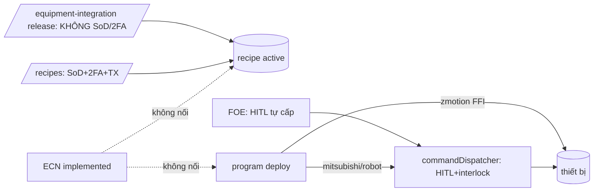

# Phụ lục F — Lớp nền: kiến trúc · RBAC · cờ · DB · data flow · realtime · hiệu năng · audit · test

> Thuộc doc 80. 2026-09-25 · HEAD `84f12c7d5` · pha PLAN. DB đọc bằng `avi_app` + `default_transaction_read_only=on`. HTTP thật engineer1.
> Số thô (ngoài repo): scratchpad phiên `F-platform/` — `tstats.txt`, `counts.txt`, `schema.txt`, `lat_engineer*.txt`, `walk*.txt`, `procs*.txt`, `explain.sql`, `sock.mjs`.
> ⚠ Dữ liệu ở mức đồ chơi (≤175 hàng/bảng; 7 artifact, content TB 117 ký tự) ⇒ số hiệu năng DB không đại diện quy mô nhà máy.

**Điểm:** kiến trúc 5,5 · RBAC 4,5 · DB 6,0 · data flow 4,5 · hiệu năng 6,0 · observability 6,0 · test 3,0 → **~5,1/10**. Các cơ chế an toàn đúng đều đã có, nhưng có đường vòng qua chúng.

## 1. Bản đồ kiến trúc (màn → tRPC → service → bảng)

| Màn | Procedure chính | Service | Bảng (hàng live) |
|---|---|---|---|
| /engineering-home | `oversight.pendingSummary` | oversightRouter (SQL trực tiếp) | machine_recipes 5, interlock_rules 1, orchestration_runs 6, safety_events 0 |
| /engineering | 23 `programming.*`, `aiProgrammingKb.search`, `machine.list` | programmingService + 6 adapter, fleetRollout, aiProgrammingCopilot, engineeringStream | program_projects 4, artifacts 7, builds 3, sim_runs 3, deployments 3 (**cả 3 `simulated` seed**), symbols 0 |
| /engineering-changes | `ecn.*`, `productModel.list` | ecnService | engineering_changes 3, items 4 |
| /recipes | `machineRecipe.*` | db/machineRecipe.ts, configDriftService | machine_recipes 5, recipe_deployments 3, machine_config_state 1 |
| /interlock-rules | `interlock.*` (10) | ruleEvaluator, interlockGate, interlockEngine, controlAuditService | interlock_rules 1, events 3, control_audit_log 1 |
| /orchestration-studio | 12 `orchestration.*`, `equipment.listEquipment` | foeEngine, runEventStore, commandDispatcher | workflows 5, versions 5, runs 6, run_steps 17, run_events 0 |
| /ir-editor, /pou-studio | 9 `ir.*`; `programming.pou*/plcopen*` | programming/ir, iec61131 | program_artifacts |
| /programming-copilot | `programming.copilotGenerate/Complete` | aiProgrammingCopilot → aiGateway | ai_gateway_metrics |
| /fleet-orchestration | 25 `fleet.*` + `twin.occupancyGrid` | taskAllocator, trafficManager | tasks 2, zones 4, robots 3, **robot_telemetry 1 689 093 hàng / 214 MB** |
| /safety-workforce | 16 `safety.*` | safety/*, workforce/* | safety_events 0, safety_plc_configs 1 |
| /equipment-standards | 18 `equipmentStandards.*` | standards/* | device_types 31, alarm_taxonomy 175, master_alarms 13 |
| /equipment-integration | 11 `equipmentIntegration.*` | recipeVersioningService | **dùng chung** machine_recipes + recipe_deployments |

Tổng **12 router, 200 procedure** (98 mutation / 102 query). 4 router không gắn cổng license (`aiOrchestrationRouter`, `equipmentStandardsRouter`, `equipmentIntegrationRouter`, `oversightRouter`). `orchestration_run_events` khai ở schema nhưng không được `schema/index.ts` export.

## 2. RBAC — ma trận 3 lớp

Quyền thật (không phải admin): operator ×3 `ms:V` · supervisor ×4 (`ms:V` … `interlock:VCED, mc:VCE`) · maint1 `mc:VE, ms:V` · engineer1 `interlock:V, mc:VCE, ms:VCE`. (ms = machine_status, mc = machine_control; alias `machine_monitoring → machine_status` ở cả client và server.)

| Màn | Nav | RouteGuard | Server đọc | Server ghi | Lệch |
|---|---|---|---|---|---|
| home / studio | mc | navHref | ms V | — | ổn |
| /engineering | mc | navHref | ms V | write/deploy + mc C/E; **validate/simulate/start-stopWatch/copilot chỉ ms V** | RBAC-03 |
| /engineering-changes | mc | navHref | **không kiểm** | create: ai đăng nhập cũng được | RBAC-02 |
| /recipes | mc | navHref | mc V | archive/setGolden protected; approve/deploy/rollback actuation | maint1 archive được |
| /interlock-rules | interlock | navHref | interlock V | actuation; approve **chỉ admin** | supervisor VCED không duyệt được |
| /orchestration-studio | mc | navHref | ms V | deployProcedure (+OTP); run actuation | ổn |
| /ir-editor | **ms** | **mc** | ms V | write + mc C | **RBAC-01** |
| /pou-studio | **ms** | **mc** | ms V | write | **RBAC-01** |
| /fleet-orchestration | **ms** | **mc** | ms V | actuation + mc C | **RBAC-01** |
| /safety-workforce | ms | ms | ms V | 16 mutation protected (không sàn vai/2FA) | RBAC-04 |
| /equipment-standards | ms | ms | ms V | protected + mc C (delete dùng canCreate) | RBAC-04 |
| /equipment-integration | ms | ms | ms V | protected + mc C | RBAC-04 + FLOW-01 |

Điểm mạnh đã kiểm: `actuationProcedure` = sàn vai + 2FA; `deployProcedure` OTP tươi mỗi lượt; dispatcher kiểm lại HITL. Lưu ý: `AUTH_2FA_BAT_BUOC=0` (nội bộ) + engineer1 `twoFactorEnabled=false` ⇒ engineer **không deploy được** trong cấu hình hiện tại (UI báo đúng lý do).

## 3. Cờ tính năng (chỉ tên + ON/OFF)

**ON:** DPC_DEPLOY, DPC_STREAMING, DPC_VERSION_REVIEW, DPC_DEPLOY_APPROVAL, DPC_IR_V2 · AI_PROGRAMMING_COPILOT (**khai 2 lần** trong `.env`), PROG_KB, PROG_CODEGEN_VALIDATE_REQUIRED, AI_CODE_ROUTER · FOE, ORCHESTRATION, AI_ORCHESTRATION(_ADVISOR) · FLEET_ORCH, FLEET_RESOURCE, TWIN_LIVE · SAFETY_AUDIT, WORKFORCE, SAFETY_PLC_ADAPTER · EQ_GOVERN, EQ_INTEG, VISION_ADAPTERS · **OT_CONTROL, ROBOT_CONTROL** (đã gỡ dry-run) · ACTUATION_STEPUP_2FA, TENANT_RLS (bật nhưng trơ).
**OFF/chưa đặt:** DPC_ONLINE_FORCE, DPC_HIL · **FOE_DURABLE, FOE_SIM_GATE_REQUIRED** · SAFETY_ZONE_SW/VISION/ESTOP_ADAPTER · **INTERLOCK_AUTO_BLOCK** (+ INTERLOCK_ENGINE vắng) · OT_COMMISSIONING_REQUIRED · CONFIG_SYNC_GENERIC, CONFIG_DRIFT_REPORT · LICENSE_MODULE_GATE, LICENSE_ROUTE_GUARD · AUTH_2FA_BAT_BUOC=0.

**PLT-02 — khi cờ OFF có 4 kiểu hợp đồng:** 409 `FEATURE_DISABLED` (fleet, safety, eqStd, eqInteg, ir, twin) · 200 `{ok:false, enabled:false}` (FOE) · 200 `status:"simulated"` (DPC deploy) · 200 `{available:false}` (copilot). Client có 7 endpoint `status` riêng; 4 trang mặc định **lạc quan** `?? true` khi đang tải/lỗi. Quan sát live (phiên chính): trên `/engineering` lúc đang tải hiện "Triển khai: OFF" + banner "DPC_DEPLOY_ENABLED đang TẮT" + "Chưa có dự án", vài giây sau thành "Triển khai: ON" + 4 dự án — **trạng thái mặc định khi đang tải bị hiển thị như sự thật**, và banner lộ tên biến môi trường cho người dùng.

## 4. Database

- PK 46/46; UNIQUE nghiệp vụ tốt (gồm partial unique `machine_recipes(code) WHERE active`, `program_deployments(idempotencyKey)`, `command_log(idempotencyKey)`).
- **FK chỉ 8/46 bảng** (nhóm recipe). program_*, orchestration_*, interlock_events→rules, ecn_items→ecn, fleet đều không FK. Mồ côi hiện 0/11 quan hệ đã kiểm (dữ liệu nhỏ).
- WORM: `audit_logs`, `control_audit_log`, `command_log` chỉ INSERT+SELECT, RLS FORCE, `control_audit_log` có chuỗi băm. `program_deployments` không DELETE. `recipe_deployments`, `interlock_events`: avi_app vẫn DELETE/UPDATE được.
- Retention: `audit_logs` (hypertable) **xoá sau 365 ngày**; `robot_telemetry` nén 14 ngày, xoá 365 ngày; bảng module khác không retention.
- Tenant: `program_projects` 4/4 `corporateCode` NULL; policy trả TRUE khi GUC chưa bật; router không lọc tenant (trừ fleet đọc).
- Drift cột drizzle↔DB: **0 / 45 bảng**. Drift index: `tasks.uq_tasks_key`, `zones.uq_zones_code` (drizzle khai không unique), `idx_orch_runs_edge_node` chỉ có ở DB. 9 index thừa (trùng UNIQUE/PK prefix).
- EXPLAIN ANALYZE 11 truy vấn nóng: <0,5 ms (riêng audit_logs theo action 6,5 ms quét 12 chunk). Rủi ro khi tăng: `listArtifacts/Builds/Deployments/Symbols` không LIMIT + `select *` kể cả `content` mọi version; `alarmKpis` kéo 20 000 hàng về Node; `pendingSummary` 10 câu tuần tự.

## 5. Data flow & process

**Chương trình (DPC):** author → validate (quyền XEM) → review (SoD) → build → simulate (quyền XEM) → deploy → watch → rollback. Hai đường deploy: A `deployBuild` nhận `confirmedBy` **số nguyên do client gửi**; B Approval Inbox. Adapter: mitsubishi/robot-tm qua dispatcher ✔; **zmotion FFI trực tiếp ✖**; iec61131 luôn `failed`; ir-flow/stub luôn `simulated`. `audit_logs` có 3 lượt `deployBuild`, cả 3 `failure` ⇒ **chưa từng có deploy thật thành công** trong DB này.
**ECN:** SoD chỉ ở approve; `implement` chỉ ghi `implementedBy/At`, không chạm recipe/program ⇒ ECN là giấy tờ rời; không TX.
**Recipe:** `/recipes` TX + `FOR UPDATE` + kiểm `approvedBy` (tốt), deploy không đẩy lệnh xuống máy; `/equipment-integration` có TX riêng **không kiểm approvedBy** (FLOW-01).
**Interlock:** gate fail-closed khi DB lỗi, inline ở OT/robot dispatcher + bước lệnh FOE; **không phủ đường zmotion**.
**FOE:** `startRun` đồng bộ trong request; không bắt mô phỏng trước deploy; tự cấp HITL `executed` cho mọi bước; FOE_DURABLE OFF ⇒ restart phải resume tay.

## 6. Realtime & hiệu năng

- **PLT-01 (P0, đã thử thật):** handshake socket tự khai `auth.clientType:"machine"` được bỏ qua kiểm cookie (`server/_core/socket.ts:196-201`, phiên chính đã đọc: comment thiết kế "machine clients bypass cookie check because they authenticate per-event via apiKey") — nhưng client đó vẫn gửi được `engineering:subscribe` và join phòng **không kiểm quyền**. Phép thử: không cookie → `REJECTED UNAUTHORIZED`; không cookie + clientType machine → `CONNECTED`. Hậu quả: rò giá trị PLC live, sự kiện an toàn, telemetry. (Vấn đề mức nền tảng, không riêng module.)
- Polling: Fleet 4–5 query/5 s; interlock events 5 s; Integration 5 s trần; Orchestration 2 s thích ứng (nhưng vô hạn khi có run held). Safety/watch dùng socket. Rate limit 300 req/phút/phiên (phép đo chạm 429 sau ~300 lượt).
- HTTP p50 **14–35 ms** mọi query module (lượt nguội p95 ≤343 ms). Ngoại lệ: `equipment.listEquipment` **834 KB**, `productModel.list` **332 KB**, `machineRecipe.machines.list` 137 KB, `aiProgrammingKb.search` **1,76 s p50**; LLM task `code` TB 16,5 s, max 146 s.
- Bundle: entry `index` 235 KB gz + **`vendor-three` 420 KB gz modulepreload** (React nằm chung chunk với three.js, `vite.config.ts:73-79`). Chi phí thêm theo trang (gz): Hub 4 · Studio 14 · **Workspace 197** · ECN 38 · Recipes 15 · Interlock 13 · Orchestration 93 · IR 91 · **POU 230** · Copilot 163 · Fleet 25 · Safety 129 · Standards 127 · Integration 20. `CodeEditor` 151 KB gz nạp tĩnh 6 legacy mode.
- **Quan sát live (phiên chính):** font chính **Geist / Geist Mono không bao giờ tải được** — trình duyệt báo `Failed to decode downloaded font … geist-*-wght-normal.woff2` + `OTS parsing error: invalid sfntVersion: 1008821359` (= chuỗi `<!DO`, tức server trả **HTML** — SPA fallback — cho URL `/assets/@fontsource-variable/...`). Toàn app, kể cả editor mã, đang chạy bằng font dự phòng. Batch khởi động `permissions.getMyPermissions,commandCenter.hierarchy,aiInbox.count,andon.active,license.*` mất ~1–1,4 s và chặn cả sidebar lẫn trang (sidebar trống tới khi xong). Mỗi trang đều gắn `data-loc="client\src\..."` vào DOM production (plugin jsx-loc lộ đường dẫn mã nguồn).

## 7. Audit & observability

Middleware audit ghi **mọi mutation** kể cả thất bại (query thì không). `audit_logs` WORM + HMAC nhưng xoá sau 365 ngày. Audit miền (`control_audit_log`, chuỗi băm) không đồng đều: có ghi interlock, standards, IR, workforce; **không ghi** programming deploy/approve, orchestration deploy/start/abort, integration release, fleet — toàn DB **1 hàng**. Correlation-id có (middleware + AsyncLocalStorage + `command_log.correlation_id`) nhưng **không ghi vào audit**. `ai_llm_audit` 14 236 hàng nhưng chỉ cho rca/report/vision (copilot không lưu hash prompt/response). `prom-client` không được import ⇒ 0 metric cho module. Service dùng `console.*` thay pino.

## 8. Test

Router có test: programming 21 ca + stepUp 14; machineRecipe 15 + configSync 25 — **tất cả mock DB và mock `accessControl`**. **0 test:** ecn, interlock, fleet, safety, equipmentStandards, equipmentIntegration, oversight. Service unit (mock): programming ~334, orchestration 110, safety 92, equipment 84, standards 70, fleet 55, interlock 32. **Client 0, E2E 0, tích hợp Postgres thật 0** (dù hạ tầng `_test` đã có). Không test nào chứng minh deploy tới thiết bị, race allocate, hay lệch nav/route.

## 9. Phát hiện

| ID | Mức | Phát hiện · bằng chứng | Hậu quả |
|---|---|---|---|
| PLT-01 | **P0** | Socket `clientType:"machine"` bỏ qua xác thực; join phòng không kiểm quyền · `socket.ts:196-201, 229-387`, đã thử | Rò giá trị PLC, sự kiện an toàn, telemetry |
| FLOW-01 | **P0** | Release/rollback recipe qua eqInteg bỏ qua duyệt, sàn vai, 2FA · `recipeVersioningService.ts:160-273` | Recipe chưa duyệt thành `active` |
| FLOW-02 | P1 | `confirmedBy` do client gửi; cờ approval chỉ áp cho fleet · `programmingRouter.ts:447,478` | Four-eyes hình thức ngoài dispatcher |
| FLOW-03 | P1 (P0 khi có HW) | zmotion FFI bỏ qua dispatcher/interlock · `zmotionBasicAdapter.ts:338-404` | Ghi ROM thật không interlock khi đặt `ZMC_ENDPOINT` |
| FLOW-04 | P1 | 0 transaction trong programmingService; approve bắn đôi; idempotency trả 500 | Deploy lặp, trạng thái kẹt |
| FLOW-05 | P1 | `fleet.allocate` không khoá · `taskAllocator.ts:369-411` | Gán task 2 lần |
| RBAC-01 | P1 | Nav/route lệch 3 màn · `App.tsx:581,592,593` | 5 user thật thấy menu → bị chặn |
| RBAC-02 | P1 | ECN không kiểm quyền · `ecnRouter.ts:7,67,92,101` | Mọi tài khoản đọc/tạo ECN qua API |
| PERF-01 | P1 | three.js + React chung chunk preload | +420 KB gz mọi trang |
| TST-01 | P1 | 7 router 0 test; 0 client/E2E/tích hợp DB | Không lưới nào bắt được P0/P1 ở trên |
| PLT-06 | P1 | Font Geist/Geist Mono trả HTML (quan sát live) | Toàn app + editor mã chạy font dự phòng |
| RBAC-03 | P2 | 8 mutation chỉ cần quyền XEM (watch ≥100 ms, copilot) | Đọc PLC tần số cao, chiếm GPU |
| RBAC-04 | P2 | 53 mutation không sàn vai; delete dùng canCreate | Không nhất quán actuation |
| PLT-02 | P2 | Cờ OFF 4 kiểu hợp đồng; `?? true`; trạng thái mặc định khi tải hiện như sự thật | UI hứa rồi 409 / hiển thị sai |
| PLT-03 | P2 | Hai triển khai vòng đời recipe trên cùng bảng | Cổng trôi (FLOW-01) |
| PLT-04/05 | P2 | startRun đồng bộ; FOE_DURABLE OFF; FOE không bắt sim | Request treo; resume tay |
| FLOW-06/07 | P2 | ECN không nối xuống; FOE tự cấp HITL | ECN "implemented" không bảo đảm gì |
| DB-01/03/04 | P2 | 38/46 bảng không FK; drift index; tenant NULL | Mồ côi; drizzle-kit đề xuất sai; lộ chéo đa nhà máy |
| OBS-01..04 | P2 | correlation-id ngoài audit; 0 metric; audit miền không đều; audit xoá 365 ngày | Không truy vết/SLO; mất bằng chứng |
| PERF-02..05 | P2 | CodeEditor 151 KB; payload 834/332/137 KB; poll 5 s; KB search 1,8 s | Nặng, chậm khi tăng |
| TST-02 | P2 | Test RBAC mock `accessControl` | "Xanh" không chứng minh quyền thật |
| PLT-07 | P3 | `data-loc` đường dẫn mã nguồn trong DOM production (quan sát live) | Lộ cấu trúc mã, DOM nặng |
| RBAC-05/06, DB-02, PERF-06, DB-05 | P3 | license gate thiếu; interlock.approve chỉ admin; 9 index thừa; alarmKpis 20k hàng; dữ liệu đồ chơi | — |

## 10. Thiết kế cải tiến lớp nền

1. **Registry capability — một nguồn sự thật cho gating (L).** `shared/capabilities.ts` khai mỗi capability `{module, action, floor, flag, license, sod}`; `ROUTE_CAP` route → capability. Server `capProcedure(cap)` gom sàn vai + requirePermission + moduleGate + requireFlag. Nav + RouteGuard suy từ `ROUTE_CAP` ⇒ RBAC-01 không thể tái diễn. Query `platform.myCapabilities` trả `{allowed, reason}` để UI khoá nút kèm lý do. Census AST: mọi procedure dùng `capProcedure`; lưới "menu hiện ⇔ route vào được" chạy trên bảng quyền thật `_test` DB.
2. **Chuẩn cờ OFF (M).** Một `platform.featureStates` thay 7 endpoint; mutation OFF ⇒ luôn 409 `FEATURE_DISABLED`; `<FeatureGate>` **fail-closed** khi đang tải/lỗi (skeleton, không hiển thị trạng thái mặc định như sự thật); xoá mọi `?? true`; không hiển thị tên biến môi trường cho người dùng cuối.
3. **DB (M).** FK `NOT VALID` → `VALIDATE` (program_artifacts→projects, builds→artifacts, deployments→builds, sim_runs→builds, interlock_events→rules, ecn_items→ecn, runs→workflows, run_steps→runs); `DROP INDEX CONCURRENTLY` 9 index thừa; index `program_projects("updatedAt" DESC)`, `safety_events("createdAt" DESC) WHERE "auditedAt" IS NULL`; API list trả metadata không `content`; endpoint picker `*.options` có search + limit 50; backfill tenant + lọc tenant ở router; audit deploy/duyệt không bị xoá sau 365 ngày; đồng bộ `uniqueIndex` drizzle↔DB.
4. **Outbox sự kiện miền + audit bất biến (M).** Bảng `engineering_domain_events(aggregate, event, actor, correlation_id, payload_hash, prev_hash)` ghi trong cùng TX với chuyển trạng thái, WORM. Worker đọc outbox ⇒ phát socket có kiểm quyền, đẩy metric, làm cổng ECN↔recipe/program. Audit ghi `requestId: getCorrelationId()`; `console.*` → pino.
5. **Hotfix luồng (S/M).** PLT-01: handshake `machine` phải xuất trình apiKey, client machine không được subscribe phòng, join phòng kiểm quyền + phạm vi (cờ chuyển tiếp log-only trước khi chặn). FLOW-01: release/rollback gọi hàm cổng `deployRecipe` duy nhất, router → `actuationProcedure`. FLOW-02/03: bỏ `confirmedBy` khỏi input, production chỉ qua Approval Inbox, zmotion qua `deviceWriteGate` chung (interlock + commissioning + HITL verify). FLOW-04: trạng thái `deploying` + `FOR UPDATE`, bắt unique violation. FLOW-05: `UPDATE tasks … WHERE status='pending' RETURNING id`. PLT-04/05: `startRun` async mặc định; bật `FOE_DURABLE` + `FOE_SIM_GATE_REQUIRED`. PLT-06: phục vụ đúng tệp font (hoặc sửa đường dẫn fontsource trong build) + test khẳng định `Content-Type: font/woff2`.
6. **Realtime thay polling (M).** Phòng có kiểm quyền: `fleet:factory:{id}`, `interlock:factory:{id}`, `orch:run:{id}`, `eng:project:{id}`; client invalidate khi nhận sự kiện, poll dự phòng 30 s. Nghiệm thu: request nền Fleet giảm ≥80 %.
7. **Ngân sách hiệu năng (đo trong CI bằng `bundle.mjs`/`lat.mjs`):**

| Chỉ số | Hiện tại | Ngân sách |
|---|---|---|
| JS entry gz | 655 KB | ≤300 KB (tách `vendor-react`; three chỉ ở màn 3D) |
| JS thêm theo trang gz | tới 230 KB | ≤150 KB (mode CodeMirror nạp theo ngôn ngữ) |
| Payload query picker | 834 KB | ≤100 KB |
| p95 query list (seed ×10) | chưa đo | ≤150 ms |
| p95 KB search | 2,0 s | ≤500 ms hoặc async |
| Batch khởi động chặn sidebar | ~1–1,4 s | ≤300 ms (tách permissions khỏi batch nặng) |
| Deploy | không metric | `deploy_duration_seconds` |

8. **Test (L).** Census RBAC chạy thật: `createCaller` × 5 vai × 200 procedure trên `_test` DB, không mock `accessControl`. Tích hợp Postgres thật: approve bắn đôi, allocate đồng thời, release recipe chưa duyệt bị từ chối, cổng ECN. Playwright 5 persona × 14 tuyến. Socket: machine không apiKey bị từ chối; join phòng ngoài phạm vi bị từ chối.

| Đợt | Nội dung | Công | Rủi ro |
|---|---|---|---|
| 0 | PLT-01, FLOW-01, FLOW-05, RBAC-01/02, PLT-06 | S (2–3 ngày) | Máy khách machine hiện trường chưa gửi apiKey ⇒ cờ chuyển tiếp + log trước khi chặn |
| 1 | FLOW-02/03/04, PLT-04/05, RBAC-03/04 | M (1–1,5 tuần) | Cần FAT trên thiết bị thật |
| 2 | Capability registry + featureStates | L (2–3 tuần) | Làm dần từng router, census giữ không lùi |
| 3 | Outbox + audit + metrics | M | Tăng ghi mỗi mutation |
| 4 | DB: FK / index / tenant / retention | M | Nên làm sớm khi bảng còn nhỏ |
| 5 | Perf: chunk / payload / realtime | M | Phải chạy `build`, không chỉ `check` |
| 6 | Test tích hợp + Playwright | L | Cần seed quy mô |

## 11. Chưa kiểm được
Chỉ có engineer1 (RBAC vai khác suy từ mã + bảng `permissions` thật); chưa quan sát dữ liệu thực trong phòng socket; không chạy test suite/`tsc`; chưa đo quy mô thật; `.env` có thể khác môi trường tiến trình server (chỉ cờ DPC được xác nhận qua `programming.status`); FLOW-04 (dòng 659-711) và FLOW-07 lấy từ đọc mã, chưa tự kiểm từng dòng.
